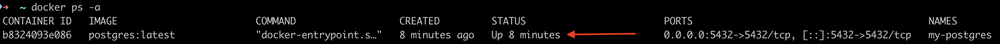
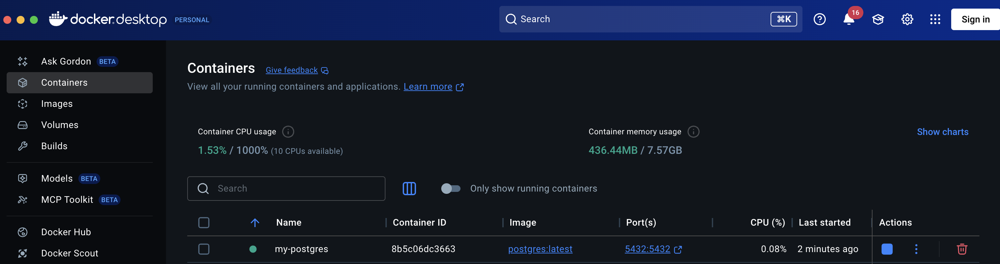
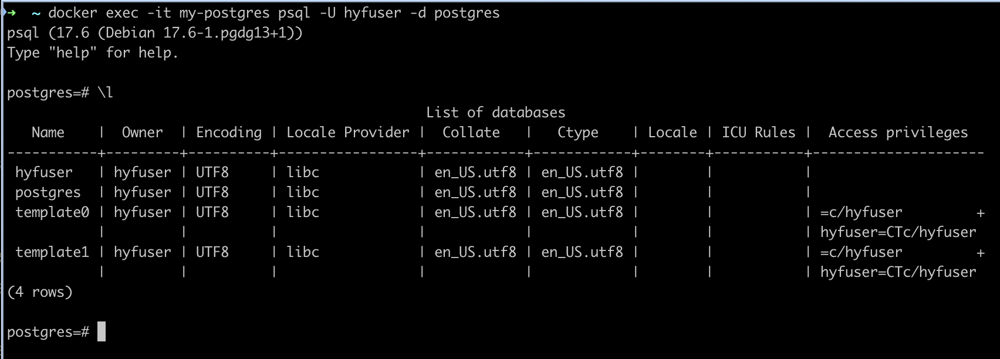

# PostgreSQL Setup Guide

In this document you'll learn how to set up your first PostgreSQL database. You have several options for running PostgreSQL, and we recommend using Docker for the best learning experience.

## Install PostgreSQL with Docker

Docker provides an easy and consistent way to run PostgreSQL across different operating systems.

### Step 1: Install Docker Desktop

Install [Docker Desktop](https://www.docker.com/products/docker-desktop/) for your operating system.

> **Note:** If you use an older macOS version, the latest Docker Desktop may not be supported. Download an older version that supports your macOS installation:
> - macOS 12 Monterey - [Version 4.41.2](https://docs.docker.com/desktop/release-notes/#4412)
> - macOS 11 Big Sur - [Version 4.24.2](https://docs.docker.com/desktop/release-notes/#4242)

After the installation, open Docker Desktop and confirm that the Docker engine is running (check the bottom left of the window).

**[Optional]** To learn more about Docker:
- Read: [What is Docker?](https://docs.docker.com/get-started/docker-overview/) (Official documentation)
- Watch: [What is Docker in 5 minutes](https://www.youtube.com/watch?v=_dfLOzuIg2o)

### Step 2: Create PostgreSQL Container

Run the following command:

```bash
docker run -d --name my-postgres -e POSTGRES_USER=hyfuser -e POSTGRES_PASSWORD=hyfpassword -p 5432:5432 postgres:latest
```

This command will first download the PostgreSQL docker image from [DockerHub](https://hub.docker.com/_/postgres) and then create and a new PostgreSQL docker container. It may take a couple of minutes.

### Step 3: Verify Container Status

Once the command has been successfully executed, confirm that your container is running using the following command:

```bash
docker ps -a
```

Confirm that the status of the container shows "Up":


You can also confirm the status using the Docker Desktop app:


If you followed the steps correctly, your local PostgreSQL server should be running with the following settings:
- **Container name:** `my-postgres`
- **Host and port:** `localhost:5432`
- **Username:** `hyfuser`
- **Password:** `hyfpassword`

### Step 4: Connect to the Database

Connect to your database using the powerful `psql` command-line tool:

```bash
docker exec -it my-postgres psql -U hyfuser -d hyfuser
```

You should see the psql prompt:
```
psql (17.6 (Debian 17.6-1.pgdg13+1))
Type "help" for help.

postgres=#
```

Next, type the command `\list` or `\l` to show all databases:



You'll see a few system databases that are managed by the PostgreSQL server - you can ignore these.

Let's create your first database by executing the following command:

```sql
CREATE DATABASE userdb;
```

Confirm the database was created using the `\list` command again. Finally, type `exit` to leave `psql`.

## GUI Tools for Database Management

Using the command line isn't always the most convenient way to manage your PostgreSQL server. Here are some free GUI tools:

### 1. pgAdmin
pgAdmin is a free and open-source web-based administration tool for PostgreSQL servers. It provides a comprehensive interface for database management.

[Download pgAdmin](https://www.pgadmin.org/download/)

### 2. VS Code Extension
Database Client is a free VS Code extension that can connect to many different database providers, including PostgreSQL. It allows you to manage databases directly from your code editor.

[Download Database Client](https://marketplace.visualstudio.com/items?itemName=cweijan.vscode-database-client2)

### 3. DataGrip
DataGrip is a powerful database management IDE developed by JetBrains. It supports many database providers including PostgreSQL. While it's not free, it offers a 30-day trial. Trainees can get it for free through the GitHub Education Program.

[Download DataGrip](https://www.jetbrains.com/datagrip/)

## Appendix: Managing Your Docker Container

**Stop your container:**
```bash
docker stop my-postgres
```

**Start your container:**
```bash
docker start my-postgres
```

**Connect to your container's shell:**
```bash
docker exec -it my-postgres bash
```

**Check container logs:**
```bash
docker logs my-postgres
```

**Delete your container (to start over):**
```bash
docker rm my-postgres
```

