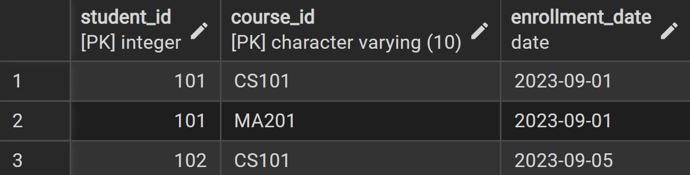
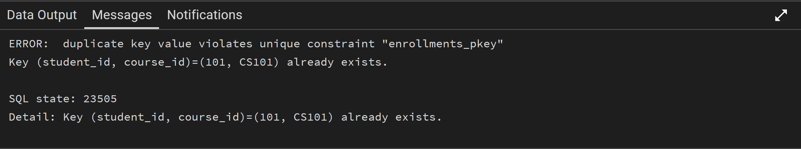

## 1. Identifiers: Primary Key, Foreign Key, and Composite Key

Imagine you have a big collection of things, like your favorite toys, books, or even friends. How do you tell them apart? You probably use a special name or a unique feature. In databases, we do something similar with "identifiers" or "keys." They help us find and connect different pieces of information.

### What are Identifiers (Keys)?

Think of a database as a bunch of organized lists, like spreadsheets. Each list (which we call a "table") holds information about one type of thing, like `Students` or `Courses`. To make sure every item in our list is unique and to link related lists together, we use special columns called keys.

1.  **Primary Key (PK): Your Item's Unique ID**
    *   A Primary Key is like a special ID number for each row (each item) in your table. It must be unique for every single item, and it can never be empty.
    *   **Rule 1: Always Unique:** No two items in your list can have the same Primary Key. Just like no two people have the same passport number.
    *   **Rule 2: Never Empty:** A Primary Key can never be blank or unknown. It must always have a value.
    *   **Only One Per Table:** Each table can have only one Primary Key.

    *Example:* In a `Students` table, `student_id` would be a perfect Primary Key.

2.  **Foreign Key (FK): The Connector**
    *   A Foreign Key is a column in one table that points to the Primary Key in another table. It's how we connect related information between different lists.
    *   Think of it as a bridge that links two tables together. It shows a relationship.
    *   The value in a Foreign Key column must either match a value in the other table's Primary Key, or it can be empty (if you allow it).

    *Example:* If you have an `Orders` table, it might have a `customer_id` column. This `customer_id` would be a Foreign Key, linking each order back to the `customer_id` (Primary Key) in the `Customers` table.

3.  **Composite Key: When One ID Isn't Enough**
    *   Sometimes, a single column isn't enough to make a row truly unique. In these cases, we use a combination of two or more columns together to form a unique ID. This combination is called a Composite Key.
    *   Each part of the Composite Key might not be unique on its own, but when you put them together, they become unique.

    *Example:* In a table that tracks `Enrollments` (which student is taking which course), neither `student_id` nor `course_id` might be unique on their own (a student can take many courses, a course can have many students). But the combination `(student_id, course_id)` would uniquely identify a specific student's enrollment in a specific course.

### Simple Example: Students and Courses

Let's use our `Students` and `Courses` example to see these keys in action.

**1. Setting up Tables in pgAdmin 4 (SQL)**

First, let's create our tables in pgAdmin 4. You can open pgAdmin 4, connect to your database, and then open a Query Tool to run these commands.

```sql
-- Create the Students table
CREATE TABLE Students (
    student_id INT PRIMARY KEY, -- This is our Primary Key! Unique and not empty.
    student_name VARCHAR(100) NOT NULL,
    age INT
);
```


<p align="center">
  
</p>


```sql

-- Insert some sample students
INSERT INTO Students (student_id, student_name, age) VALUES
(101, 'Alice', 20),
(102, 'Bob', 21),
(103, 'Charlie', 20);
```


<p align="center">
  
</p>


```sql
-- Create the Courses table
CREATE TABLE Courses (
    course_id VARCHAR(10) PRIMARY KEY, -- Another Primary Key!
    course_name VARCHAR(100) NOT NULL,
    instructor VARCHAR(100)
);
```


<p align="center">
  
</p>


```sql
-- Insert some sample courses
INSERT INTO Courses (course_id, course_name, instructor) VALUES
('CS101', 'Intro to Computer Science', 'Mr. Smith'),
('MA201', 'Calculus I', 'Ms. Jones');
```


<p align="center">
  
</p>


```sql
-- Create the Enrollments table (this will use Foreign Keys and a Composite Key)
CREATE TABLE Enrollments (
    student_id INT, -- This will be a Foreign Key
    course_id VARCHAR(10), -- This will also be a Foreign Key
    enrollment_date DATE,
    -- Here, (student_id, course_id) together form the Composite Primary Key
    PRIMARY KEY (student_id, course_id),
    -- Define Foreign Key relationships
    FOREIGN KEY (student_id) REFERENCES Students(student_id),
    FOREIGN KEY (course_id) REFERENCES Courses(course_id)
);
```


<p align="center">
  
</p>


```sql
-- Insert some sample enrollments
INSERT INTO Enrollments (student_id, course_id, enrollment_date) VALUES
(101, 'CS101', '2023-09-01'),
(101, 'MA201', '2023-09-01'),
(102, 'CS101', '2023-09-05');
```


<p align="center">
  
</p>


Constraint Examples
1. Primary Key Constraint Violation
Attempting to insert a student with an existing student_id:


```sql
-- Try to insert a student with an existing student_id (will fail because of PRIMARY KEY constraint)
INSERT INTO Students (student_id, student_name, age) VALUES (101, 'David', 22);
```


<p align="center">
  
</p>


* Why the error:

* student_id is a Primary Key.

* Primary Keys must be unique. You already have a student with student_id = 101.

* Takeaway:

* You cannot have two rows with the same Primary Key. Each student must have a unique ID.


2. Foreign Key Constraint Violation
Attempting to enroll a non-existent student:


```sql
-- Try to insert an enrollment for a student that doesn't exist (will fail because of FOREIGN KEY constraint)
INSERT INTO Enrollments (student_id, course_id, enrollment_date) VALUES (999, 'CS101', '2023-09-10');
```


<p align="center">
  
</p>


* Why the error:

* student_id in Enrollments is a Foreign Key pointing to Students.

* There is no student with ID 999 in the Students table.

* Takeaway:

* Foreign Keys make sure that the student or course actually exists before you can link it. You can't enroll a student that doesn’t exist.


3. Composite Key Constraint Violation
Attempting to duplicate an enrollment:


```sql
-- Try to insert the exact same enrollment again (will fail because of COMPOSITE PRIMARY KEY constraint)
INSERT INTO Enrollments (student_id, course_id, enrollment_date) VALUES (101, 'CS101', '2023-09-01');
```


<p align="center">
  
</p>


* Why the error:

* Enrollments has a Composite Primary Key (student_id, course_id).

* This means that the same student cannot be enrolled in the same course twice.

* Takeaway:

* Composite Primary Keys prevent duplicate relationships. One student can’t be enrolled in the same course more than once.


Key Concepts
Primary Key: A unique identifier for each record in a table

Foreign Key: A field that references the primary key of another table

Composite Key: A primary key made from two or more columns

Referential Integrity: Ensuring relationships between tables remain consistent

These constraints ensure data integrity and prevent invalid data from being entered into the database.


**ERD Representation (Conceptual - using a simple text-based diagram for clarity):**


<p align="center">
  
</p>


Diagram Elements Explained

1. Connecting Lines
Purpose: Represent relationships between tables/entities

Meaning: Show how tables are connected through foreign key references

2. Crow's Feet Notation
Symbol: >-----< or similar branching line endings

Meaning: Represents "many" or "multiple" in relationships

In the diagram:

The crow's foot at the ENROLLMENTS end indicates that:

One STUDENT can have MANY ENROLLMENTS

One COURSE can have MANY ENROLLMENTS

3. Circles
Symbol: O typically at the end of relationship lines

Meaning: Represents "zero" or "optional" in relationships

In standard notation:

A circle would mean "zero" (optional participation)

No circle means "one" (mandatory participation)

The  Specific Relationships:

1. STUDENTS → ENROLLMENTS Relationship
Type: One-to-Many

Reading: One STUDENT can have MANY ENROLLMENTS

Implementation: The student_id foreign key in ENROLLMENTS references the student_id primary key in STUDENTS

2. COURSES → ENROLLMENTS Relationship
Type: One-to-Many

Reading: One COURSE can have MANY ENROLLMENTS

Implementation: The course_id foreign key in ENROLLMENTS references the course_id primary key in COURSES

3. STUDENTS ↔ COURSES Relationship
Type: Many-to-Many (implemented through ENROLLMENTS junction table)

Reading: Many STUDENTS can enroll in Many COURSES

Implementation: The ENROLLMENTS table connects both entities with foreign keys


Key Takeaways:

Crow's feet (>---<) indicate the "many" side of a relationship

Straight lines (|---|) indicate the "one" side of a relationship

Circles (O) would indicate optional participation (zero occurrences allowed)

No circles indicate mandatory participation (at least one occurrence required)

In the diagram, the relationships show that:

A student must have at least one enrollment (mandatory)

A course must have at least one enrollment (mandatory)

A student can have multiple enrollments (many)

A course can have multiple enrollments (many)


- **Students**: Each student has a unique `student_id`.
- **Courses**: Each course has a unique `course_id`.
- **Enrollments**: Links students to courses.  
  - Composite Primary Key = `(student_id, course_id)` → ensures a student cannot enroll in the same course twice.  
  - Foreign Keys → make sure `student_id` exists in Students and `course_id` exists in Courses.

---

## ✅ Summary of lessons

| Constraint Type         | What it does                          | Error happens when…                       | Takeaway                                      |
|-------------------------|--------------------------------------|------------------------------------------|-----------------------------------------------|
| Primary Key             | Unique identifier for a row          | You try to insert a duplicate            | Each row must have a unique ID               |
| Foreign Key             | Links to another table               | You reference something that doesn't exist | You can only link to valid rows             |
| Composite Primary Key   | Unique combination of two or more columns | You insert the same combination twice   | Prevents duplicate relationships            |


**2. Checking Data with Node.js**

To see how Node.js interacts with these tables, refere to refer to `js-code` folder.


**How to run this Node.js example:**
1.  Go to `js-code` folder and open a JS file named `CheckingDataWithNode.js`.
2.  Open your terminal or command prompt.
3.  Navigate to the `js-code` folder where the file is saved.
4.  Make sure you first drop demo_db database in pgAdmin 4.
4.  Run the command: `node CheckingDataWithNode.js`

You will see the data from your `Students`, `Courses` and `Enrollments` tables printed in your console, showing how the keys organize the data.


### The Main Idea (Essence)

Keys are like the unique IDs and connectors in your database. **Primary Keys** give each item a unique, never-empty ID. **Foreign Keys** link items between different tables. **Composite Keys** use a combination of columns to create a unique ID when one column isn't enough. They are super important for keeping your data organized and connected!