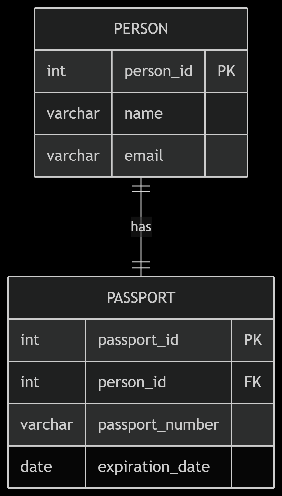
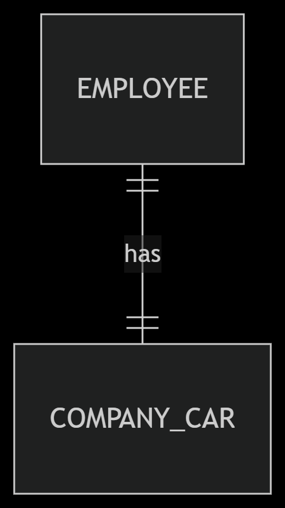
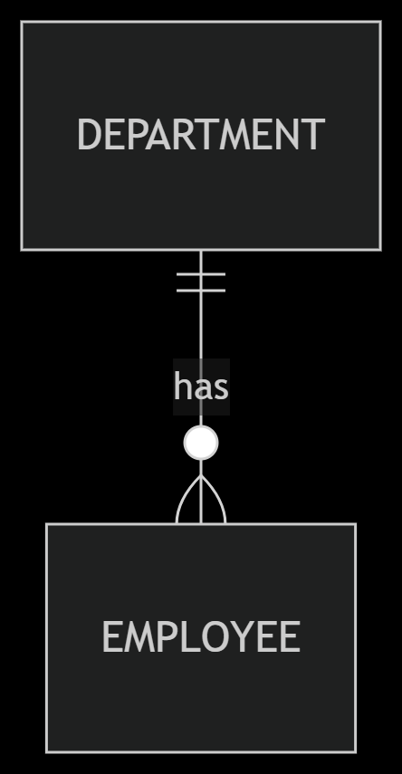

## 2. Relationships: How Tables Talk to Each Other

Databases are not just random lists; they are designed to store information that is connected. "Relationships" show how data in one table is linked to data in another table. Understanding these links is super important for building a good database.

### What are Relationships?

Imagine you have different groups of friends. Some friends are in your family, some are from school, and some are from your sports team. You have different ways of relating to each group. Databases work similarly, connecting different groups of information (tables) in specific ways.

We describe these connections using something called **cardinality**, which simply means "how many" instances of one thing are linked to "how many" instances of another thing.

There are three main types of relationships:

1.  **One-to-One (1:1): A Perfect Pair**
    *   This means one item in Table A is linked to exactly one item in Table B, and one item in Table B is linked to exactly one item in Table A.
    *   It's like a perfect pair. For example, one person has one passport, and that passport belongs to only one person.

    <p align="center">
    
    </p>

    *   We don't use this type of relationship very often because if two things are always perfectly paired, you could often just put them in the same table. But sometimes it's useful for special cases, like keeping sensitive information separate.

    *Example:* An `Employee` has one `Company Car`, and that `Company Car` is used by only one `Employee`.

   
    


2.  **One-to-Many (1:M) or Many-to-One (M:1): One Boss, Many Workers**
    *   This is the most common type of relationship you'll see.
    *   **One-to-Many:** One item in Table A can be linked to many items in Table B. But each item in Table B is linked to only one item in Table A.
    *   **Many-to-One:** This is just looking at the same relationship from the other side. Many items in Table B are linked to one item in Table A.
    *   We usually make this connection using a **Foreign Key**. The unique ID (Primary Key) from the "one" side of the relationship is put into the "many" side table as a Foreign Key.

    *Example:* A `Department` (the "one" side) can have many `Employees` (the "many" side). But each `Employee` works for only one `Department`.


  

  * One Department has many Employees.

  * Many Employees work in one Department.


3.  **Many-to-Many (M:N): Many Friends, Many Groups**
    *   This means one item in Table A can be linked to many items in Table B, AND one item in Table B can also be linked to many items in Table A.
    *   It's like a student taking many courses, and a course having many students.
    *   You can't directly link two tables in a Many-to-Many way. Instead, we create a special new table in the middle, often called a **junction table** or **linking table**. This junction table has Foreign Keys from both of the original tables.

    *Example:* A `Student` can enroll in many `Courses`, and a `Course` can have many `Students`.


* Many Students enroll in many Courses.

* Many Courses have many Students.


To create the M:N relationship in a database, you need a hidden junction table:


The ENROLLMENT table (hidden in the simple view) holds the connections between Students and Courses.


### Simple Examples: How to Build and See Relationships

Let's build some simple tables and see how these relationships work.

**1. Setting up Tables in pgAdmin 4 (SQL)**

We'll create tables for a simple school system. Open your pgAdmin 4 Query Tool and run these commands.

```sql
-- Drop tables if they exist to start fresh (optional, for testing)
DROP TABLE IF EXISTS StudentCourses;
DROP TABLE IF EXISTS Students;
DROP TABLE IF EXISTS Courses;
DROP TABLE IF EXISTS EmployeeCars;
DROP TABLE IF EXISTS Employees;
DROP TABLE IF EXISTS Departments;

-- 1. One-to-One Example: Employees and Company Cars
-- Each employee gets one car, and each car belongs to one employee.

CREATE TABLE Employees (
    employee_id INT PRIMARY KEY, -- Unique ID for each employee
    employee_name VARCHAR(100) NOT NULL
);

CREATE TABLE EmployeeCars (
    car_id INT PRIMARY KEY, -- Unique ID for each car
    employee_id INT UNIQUE, -- This is the Foreign Key, linking to Employees.employee_id
                            -- UNIQUE constraint ensures only one car per employee (1:1)
    car_model VARCHAR(100),
    FOREIGN KEY (employee_id) REFERENCES Employees(employee_id)
);

INSERT INTO Employees (employee_id, employee_name) VALUES
(1, 'Alice'),
(2, 'Bob');

INSERT INTO EmployeeCars (car_id, employee_id, car_model) VALUES
(101, 1, 'Toyota Camry'),
(102, 2, 'Honda Civic');

-- 2. One-to-Many Example: Departments and Employees
-- One department has many employees, but each employee works for only one department.

CREATE TABLE Departments (
    dept_id INT PRIMARY KEY, -- Unique ID for each department
    dept_name VARCHAR(100) NOT NULL
);

-- We already have an Employees table, let's add a dept_id to it
ALTER TABLE Employees
ADD COLUMN dept_id INT,
ADD CONSTRAINT fk_dept FOREIGN KEY (dept_id) REFERENCES Departments(dept_id);

INSERT INTO Departments (dept_id, dept_name) VALUES
(10, 'Sales'),
(20, 'Marketing'),
(30, 'HR');

-- Update employees to assign them to departments
UPDATE Employees SET dept_id = 10 WHERE employee_id = 1; -- Alice in Sales
UPDATE Employees SET dept_id = 20 WHERE employee_id = 2; -- Bob in Marketing
INSERT INTO Employees (employee_id, employee_name, dept_id) VALUES (3, 'Charlie', 10); -- Charlie in Sales

-- 3. Many-to-Many Example: Students and Courses
-- One student can take many courses, and one course can have many students.

CREATE TABLE Students (
    student_id INT PRIMARY KEY,
    student_name VARCHAR(100) NOT NULL
);

CREATE TABLE Courses (
    course_id VARCHAR(10) PRIMARY KEY,
    course_name VARCHAR(100) NOT NULL
);

-- This is our JUNCTION TABLE for Many-to-Many relationship
CREATE TABLE StudentCourses (
    student_id INT,
    course_id VARCHAR(10),
    PRIMARY KEY (student_id, course_id), -- Composite Primary Key
    FOREIGN KEY (student_id) REFERENCES Students(student_id),
    FOREIGN KEY (course_id) REFERENCES Courses(course_id)
);

INSERT INTO Students (student_id, student_name) VALUES
(101, 'Alice Student'),
(102, 'Bob Student');

INSERT INTO Courses (course_id, course_name) VALUES
('MATH101', 'Basic Math'),
('ENG101', 'English Writing');

INSERT INTO StudentCourses (student_id, course_id) VALUES
(101, 'MATH101'), -- Alice takes Math
(101, 'ENG101'),  -- Alice also takes English
(102, 'MATH101');  -- Bob takes Math
```

**2. Checking Relationships with Node.js**

Here is how you can create these tables and check the relationships using Node.js.

```javascript
import { setupDatabase } from './connectDatabase.js';

async function createTables(client) {
  await client.query(`
    DROP TABLE IF EXISTS StudentCourses CASCADE;
    DROP TABLE IF EXISTS Students CASCADE;
    DROP TABLE IF EXISTS Courses CASCADE;
    DROP TABLE IF EXISTS EmployeeCars CASCADE;
    DROP TABLE IF EXISTS Employees CASCADE;
    DROP TABLE IF EXISTS Departments CASCADE;

    CREATE TABLE Employees (employee_id INT PRIMARY KEY, employee_name VARCHAR(100) NOT NULL);
    CREATE TABLE EmployeeCars (car_id INT PRIMARY KEY, employee_id INT UNIQUE, car_model VARCHAR(100), FOREIGN KEY (employee_id) REFERENCES Employees(employee_id));
    INSERT INTO Employees (employee_id, employee_name) VALUES (1, 'Alice'), (2, 'Bob');
    INSERT INTO EmployeeCars (car_id, employee_id, car_model) VALUES (101, 1, 'Toyota Camry'),(102, 2, 'Honda Civic');

    CREATE TABLE Departments (dept_id INT PRIMARY KEY, dept_name VARCHAR(100) NOT NULL);
    ALTER TABLE Employees ADD COLUMN dept_id INT, ADD CONSTRAINT fk_dept FOREIGN KEY (dept_id) REFERENCES Departments(dept_id);
    INSERT INTO Departments (dept_id, dept_name) VALUES (10, 'Sales'), (20, 'Marketing'), (30, 'HR');
    UPDATE Employees SET dept_id = 10 WHERE employee_id = 1;
    UPDATE Employees SET dept_id = 20 WHERE employee_id = 2;
    INSERT INTO Employees (employee_id, employee_name, dept_id) VALUES (3, 'Charlie', 10);

    CREATE TABLE Students (student_id INT PRIMARY KEY, student_name VARCHAR(100) NOT NULL);
    CREATE TABLE Courses (course_id VARCHAR(10) PRIMARY KEY, course_name VARCHAR(100) NOT NULL);
    CREATE TABLE StudentCourses (student_id INT, course_id VARCHAR(10), PRIMARY KEY (student_id, course_id), FOREIGN KEY (student_id) REFERENCES Students(student_id), FOREIGN KEY (course_id) REFERENCES Courses(course_id));
    INSERT INTO Students (student_id, student_name) VALUES (101, 'Alice Student'), (102, 'Bob Student');
    INSERT INTO Courses (course_id, course_name) VALUES ('MATH101', 'Basic Math'), ('ENG101', 'English Writing');
    INSERT INTO StudentCourses (student_id, course_id) VALUES (101, 'MATH101'), (101, 'ENG101'), (102, 'MATH101');
  `);
  console.log('Tables for relationships created and populated.');
}

async function getEmployeeCars(client) {
    console.log('\n--- Employee and Car (One-to-One) ---');
    const res = await client.query(`SELECT e.employee_name, ec.car_model FROM Employees e JOIN EmployeeCars ec ON e.employee_id = ec.employee_id;`);
    res.rows.forEach(row => console.log(row));
}

async function getEmployeesByDepartment(client) {
    console.log('\n--- Employees by Department (One-to-Many) ---');
    const res = await client.query(`SELECT e.employee_name, d.dept_name FROM Employees e LEFT JOIN Departments d ON e.dept_id = d.dept_id;`);
    res.rows.forEach(row => console.log(row));
}

async function getStudentCourses(client) {
    console.log('\n--- Student Enrollments (Many-to-Many) ---');
    const res = await client.query(`SELECT s.student_name, c.course_name FROM Students s JOIN StudentCourses sc ON s.student_id = sc.student_id JOIN Courses c ON sc.course_id = c.course_id;`);
    res.rows.forEach(row => console.log(row));
}

async function runAllRelationshipChecks() {
  let client;
  try {
    client = await setupDatabase(true);
    await createTables(client);
    await getEmployeeCars(client);
    await getEmployeesByDepartment(client);
    await getStudentCourses(client);
  } catch (error) {
    console.error("An error occurred:", error);
  } finally {
    if (client) {
      await client.end();
      console.log('Disconnected from "demo_db".');
    }
  }
}

runAllRelationshipChecks();
```

### Exercise

1.  **pgAdmin 4:** Try to insert a new employee into the `Employees` table without assigning them to a department (set `dept_id` to `NULL`). Then, try to insert an employee and assign them to `dept_id = 99` (a department that doesn't exist). What happens? Why?
2.  **pgAdmin 4:** Imagine a `Teachers` table and a `Subjects` table. A teacher can teach many subjects, and a subject can be taught by many teachers. How would you create the tables (including the junction table) to represent this Many-to-Many relationship in SQL?
3.  **Node.js:** Modify the `runAllRelationshipChecks` script to fetch and display all departments, even those that currently have no employees. (Hint: You might need to change the `JOIN` type in `getEmployeesByDepartment()`.)

### The Main Idea (Essence)

Relationships are the glue that connects different tables in your database. They define how information flows and links together. **One-to-One** is for unique pairs, **One-to-Many** is for a single item linked to multiple others, and **Many-to-Many** uses a special **junction table** to link multiple items on both sides. These relationships are key to building powerful and organized databases.