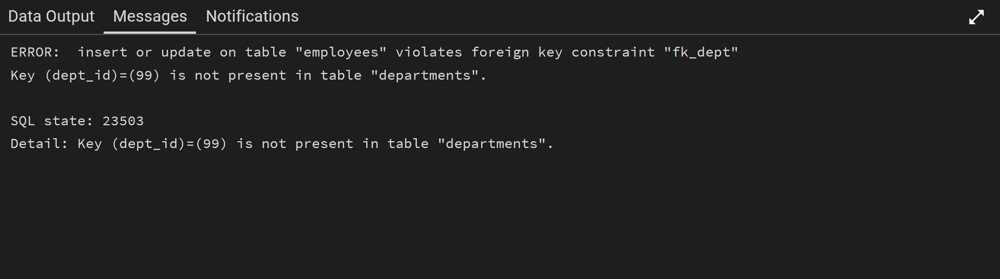

## 2. Relationships: How Tables Talk to Each Other

Databases are not just random lists; they are designed to store information that is connected. "Relationships" show how data in one table is linked to data in another table. Understanding these links is super important for building a good database.

### What are Relationships?

Imagine you have different groups of friends. Some friends are in your family, some are from school, and some are from your sports team. You have different ways of relating to each group. Databases work similarly, connecting different groups of information (tables) in specific ways.

We describe these connections using something called **cardinality**, which simply means "how many" instances of one thing are linked to "how many" instances of another thing.

There are three main types of relationships:

1.  **One-to-One (1:1): A Perfect Pair**
    *   This means one item in Table A (PERSON) is linked to exactly one item in Table B (PASSPORT), and one item in Table B (PASSPORT) is linked to exactly one item in Table A (PERSON).
    *   It's like a perfect pair. For example, one person has one passport, and that one passport belongs to only one person.

    <p align="center">
    
    </p>

    *   We don't use this type of relationship very often because if two things are always perfectly paired, you could often just put them in the same table. But sometimes it's useful for special cases, like keeping sensitive information separate.

    *Example:* An `Employee` has one `Company Car`, and that `Company Car` is used by only one `Employee`.

    <p align="center">
    
    </p>
    


2.  **One-to-Many (1:M) or Many-to-One (M:1): One Boss, Many Workers**
    *   This is the most common type of relationship you'll see.
    *   **One-to-Many:** One item in Table A can be linked to many items in Table B. But each item in Table B is linked to only one item in Table A.
    *   **Many-to-One:** This is just looking at the same relationship from the other side. Many items in Table B are linked to one item in Table A.
    *   We usually make this connection using a **Foreign Key**. The unique ID (Primary Key) from the "one" side of the relationship is put into the "many" side table as a Foreign Key.

    *Example:* A `Department` (the "one" side) can have many `Employees` (the "many" side). But each `Employee` works for only one `Department`.


    <p align="center">
    
    </p>


  * One Department has many Employees.

  * Many Employees work in one Department.


3.  **Many-to-Many (M:N): Many Friends, Many Groups**
    *   This means one item in Table A can be linked to many items in Table B, AND one item in Table B can also be linked to many items in Table A.
    *   It's like a student taking many courses, and a course having many students.
    *   You can't directly link two tables in a Many-to-Many way. Instead, we create a special new table in the middle, often called a **junction table** or **linking table**. This junction table has Foreign Keys from both of the original tables.

    *Example:* A `Student` can enroll in many `Courses`, and a `Course` can have many `Students`.


    <p align="center">
    
    </p>


* Many Students enroll in many Courses.

* Many Courses have many Students.


  **To create the M:N relationship in a database, you need a hidden junction table:**

    <p align="center">
    
    </p>


The ENROLLMENT table (hidden in the simple view) holds the connections between Students and Courses.


### Simple Examples: How to Build and See Relationships

Let's build some simple tables and see how these relationships work.

**1. Setting up Tables in pgAdmin 4 (SQL)**

We'll create tables for a simple school system. Open your pgAdmin 4 Query Tool and run these commands. To create the tables, refer to `Relationships.sql` file if you're working with pgAdmin 4 or `Relationships.js` if you're working with Node.js.


```sql
-- Drop tables if they exist to start fresh (optional, for testing)
DROP TABLE IF EXISTS StudentCourses;
DROP TABLE IF EXISTS Students;
DROP TABLE IF EXISTS Courses;
DROP TABLE IF EXISTS EmployeeCars;
DROP TABLE IF EXISTS Employees;
DROP TABLE IF EXISTS Departments;
```

```sql
-- 1. One-to-One Example: Employees and Company Cars
-- Each employee gets one car, and each car belongs to one employee.

CREATE TABLE Employees (
    employee_id INT PRIMARY KEY, -- Unique ID for each employee
    employee_name VARCHAR(100) NOT NULL
);
```

  <p align="center">
    
  </p>


```sql
CREATE TABLE EmployeeCars (
    car_id INT PRIMARY KEY, -- Unique ID for each car
    employee_id INT UNIQUE, -- This is the Foreign Key, linking to Employees.employee_id
                            -- UNIQUE constraint ensures only one car per employee (1:1)
    car_model VARCHAR(100),
    FOREIGN KEY (employee_id) REFERENCES Employees(employee_id)
);
```

  <p align="center">
    
  </p>


```sql
INSERT INTO Employees (employee_id, employee_name) VALUES
(1, 'Alice'),
(2, 'Bob');
```

  <p align="center">
    
  </p>


```sql
INSERT INTO EmployeeCars (car_id, employee_id, car_model) VALUES
(101, 1, 'Toyota Camry'),
(102, 2, 'Honda Civic');
```

  <p align="center">
    
  </p>


```sql
-- 2. One-to-Many Example: Departments and Employees
-- One department has many employees, but each employee works for only one department.

CREATE TABLE Departments (
    dept_id INT PRIMARY KEY, -- Unique ID for each department
    dept_name VARCHAR(100) NOT NULL
);
```

  <p align="center">
    
  </p>

```sql
-- We already have an Employees table, let's add a dept_id to it
ALTER TABLE Employees
ADD COLUMN dept_id INT,
ADD CONSTRAINT fk_dept FOREIGN KEY (dept_id) REFERENCES Departments(dept_id);
```

  <p align="center">
    
  </p>


```sql
INSERT INTO Departments (dept_id, dept_name) VALUES
(10, 'Sales'),
(20, 'Marketing'),
(30, 'HR');
```

  <p align="center">
    
  </p>


```sql
-- Update employees to assign them to departments
UPDATE Employees SET dept_id = 10 WHERE employee_id = 1; -- Alice in Sales
UPDATE Employees SET dept_id = 20 WHERE employee_id = 2; -- Bob in Marketing
```

  <p align="center">
    
  </p>


 ```sql 
INSERT INTO Employees (employee_id, employee_name, dept_id) VALUES (3, 'Charlie', 10); -- Charlie in Sales
```

  <p align="center">
    
  </p>


```sql
-- 3. Many-to-Many Example: Students and Courses
-- One student can take many courses, and one course can have many students.

CREATE TABLE Students (
    student_id INT PRIMARY KEY,
    student_name VARCHAR(100) NOT NULL
);
```


  <p align="center">
    
  </p>


```sql
CREATE TABLE Courses (
    course_id VARCHAR(10) PRIMARY KEY,
    course_name VARCHAR(100) NOT NULL
);
```


  <p align="center">
    
  </p>


```sql
-- This is our JUNCTION TABLE for Many-to-Many relationship
CREATE TABLE StudentCourses (
    student_id INT,
    course_id VARCHAR(10),
    PRIMARY KEY (student_id, course_id), -- Composite Primary Key
    FOREIGN KEY (student_id) REFERENCES Students(student_id),
    FOREIGN KEY (course_id) REFERENCES Courses(course_id)
);
```


  <p align="center">
    
  </p>


```sql
INSERT INTO Students (student_id, student_name) VALUES
(101, 'Alice Student'),
(102, 'Bob Student');
```


  <p align="center">
    
  </p>


```sql
INSERT INTO Courses (course_id, course_name) VALUES
('MATH101', 'Basic Math'),
('ENG101', 'English Writing');
```


  <p align="center">
    
  </p>


```sql
INSERT INTO StudentCourses (student_id, course_id) VALUES
(101, 'MATH101'), -- Alice takes Math
(101, 'ENG101'),  -- Alice also takes English
(102, 'MATH101');  -- Bob takes Math
```


  <p align="center">
    
  </p>


### Exercise

1.  **pgAdmin 4:** Try to insert a new employee into the `Employees` table without assigning them to a department (set `dept_id` to `NULL`). 

```SQL
INSERT INTO Employees (employee_id, employee_name, dept_id) VALUES (4, 'Zain', NULL);
```

OUTPUT:

  <p align="center">
    
  </p>


What happened: ✅ Success!

Why?
The foreign key constraint fk_dept you created enforces that any value in the dept_id column must exist in the Departments table's dept_id column.

However, NULL is a special case. NULL means "unknown" or "not applicable." The foreign key constraint only checks values that are actually present. It does not enforce that a value must exist; it only enforces that if a value exists, it must be valid.

So, putting NULL is perfectly acceptable and means "This employee hasn't been assigned to a department yet." This is a common and useful practice.

---

Then, try to insert an employee and assign them to `dept_id = 99` (a department that doesn't exist). What happens? Why?

```SQL
INSERT INTO Employees (employee_id, employee_name, dept_id) VALUES (5, 'Hanna', 99);
```

OUTPUT:


  <p align="center">
    
  </p>

  


What happened: ❌ Error! (You will see a "violates foreign key constraint" error)

Why?
This is the exact scenario the foreign key constraint was designed to prevent.

You are trying to put the number 99 into the dept_id column of the Employees table. The database's rule (the foreign key constraint) says:

"Before I allow this, I must check if the value 99 exists in the dept_id column of the Departments table."

The database looks at the Departments table and sees only three valid departments:

10 (Sales)

20 (Marketing)

30 (HR)

It does not find a department with dept_id = 99. Therefore, it rejects your INSERT command because it would create an "orphaned" record—an employee that belongs to a department that doesn't exist. This breaks the logical integrity of your data.

The Core Concept: Referential Integrity
This whole process is called maintaining Referential Integrity. It is arguably the most important job of a Relational Database Management System (RDBMS) like PostgreSQL.

It ensures consistency: You can't accidentally create invalid relationships between tables.

It prevents garbage data: You can't have employees in non-existent departments, orders for non-existent products, or enrollments in non-existent courses.

It makes the data reliable: You can trust that the connections between your tables are valid and meaningful.

In summary:

NULL is allowed because it means "I don't know" or "this doesn't apply."

99 is rejected because it means "this specific department," and that specific department does not exist. The foreign key constraint acts as a bouncer, only letting valid values into the club.


2.  **pgAdmin 4:** Imagine a `Teachers` table and a `Subjects` table. A teacher can teach many subjects, and a subject can be taught by many teachers. How would you create the tables (including the junction table) to represent this Many-to-Many relationship in SQL?


3.  **Node.js:** Modify the `runAllRelationshipChecks` script to fetch and display all departments, even those that currently have no employees. (Hint: You might need to change the `JOIN` type in `getEmployeesByDepartment()`.)


---
### The Main Idea (Essence)


One-to-One:
Employees (1) ───── (1) EmployeeCars

One-to-Many:
Departments (1) ───── (∞) Employees

Many-to-Many:
Students (∞) ───── (∞) Courses
       (through StudentCourses junction table)


       Complete List of Tables:
1. Employees

Columns: employee_id, employee_name, dept_id

Sample query: SELECT * FROM Employees;

2. EmployeeCars

Columns: car_id, employee_id, car_model

Sample query: SELECT * FROM EmployeeCars;

3. Departments

Columns: dept_id, dept_name

Sample query: SELECT * FROM Departments;

4. Students

Columns: student_id, student_name

Sample query: SELECT * FROM Students;

5. Courses

Columns: course_id, course_name

Sample query: SELECT * FROM Courses;

6. StudentCourses (Junction table for many-to-many relationship)

Columns: student_id, course_id

Sample query: SELECT * FROM StudentCourses;


Note:
The CASCADE option in your DROP TABLE statements ensures that when you drop tables, any dependent objects (like foreign key constraints) are also automatically removed, which is why the script can recreate all tables cleanly each time it runs.


The Purpose of the Departments Table
The Departments table is used to implement a One-to-Many Relationship with the Employees table.

The Relationship
One Department ↔ Many Employees

One department (like "Sales") can have multiple employees

But each employee belongs to only one department (in this design)


How It Works in Your Code

1. The Connection: The Employees table has a dept_id column that links to the Departments table

```sql
ALTER TABLE Employees ADD COLUMN dept_id INT;
ADD CONSTRAINT fk_dept FOREIGN KEY (dept_id) REFERENCES Departments(dept_id);
```


2. The Data:

Departments: Sales (id:10), Marketing (id:20), HR (id:30)

Employees:

Alice → Sales (dept_id:10)

Bob → Marketing (dept_id:20)

Charlie → Sales (dept_id:10)

Why This is Useful (Real-World Example)
Without the Departments table, you'd have to store department names directly in the Employees table:

employee_id	employee_name	department
1	Alice	Sales
2	Bob	Marketing
3	Charlie	Sales
Problems with this approach:

Data duplication ("Sales" appears multiple times)

Hard to update (if "Sales" changes to "Sales & Business Development", you need to update every row)

No single source of truth

With the Departments table solution:

Department names are stored only once

Easy to update department names

Prevents typos and inconsistencies

Allows reporting and analysis by department

Relationship Summary


Departments (One) ──────── (Many) Employees (One) ──────── (One) EmployeeCars
    │
    └─ Each department can have multiple employees


    So yes, the Departments table has a direct relationship with Employees, but no direct relationship with EmployeeCars. The EmployeeCars table only connects to Employees through the employee_id foreign key.


## Conclusion

Relationships are the glue that connects different tables in your database. They define how information flows and links together. **One-to-One** is for unique pairs, **One-to-Many** is for a single item linked to multiple others, and **Many-to-Many** uses a special **junction table** to link multiple items on both sides. These relationships are key to building powerful and organized databases.