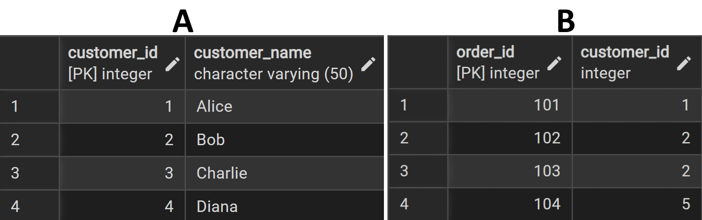
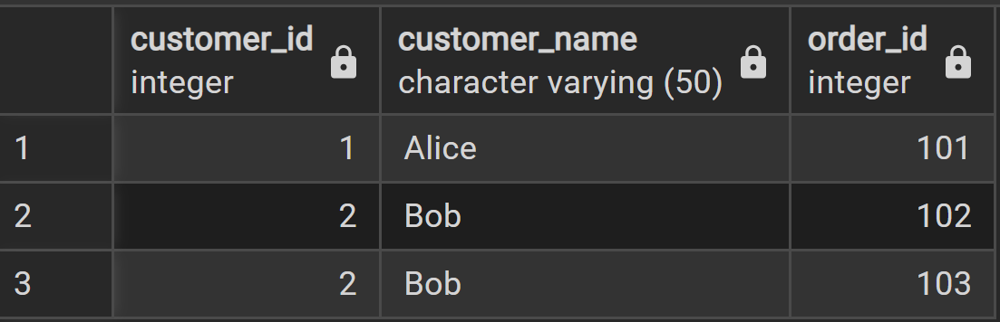
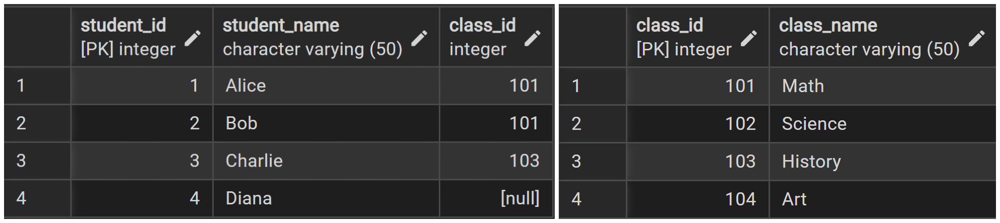
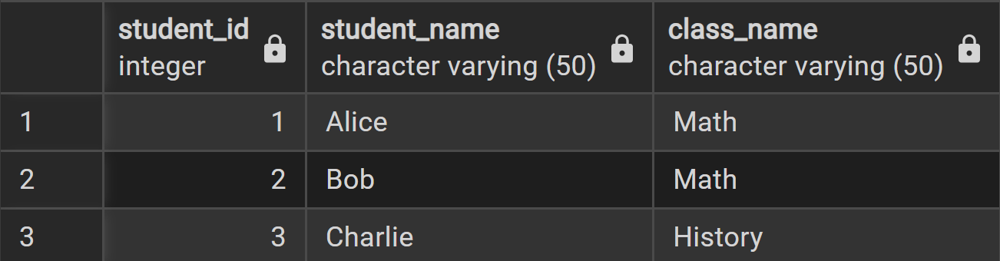
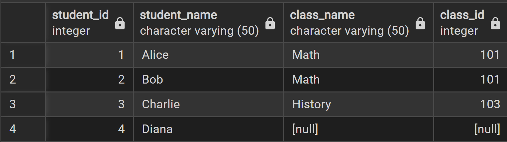
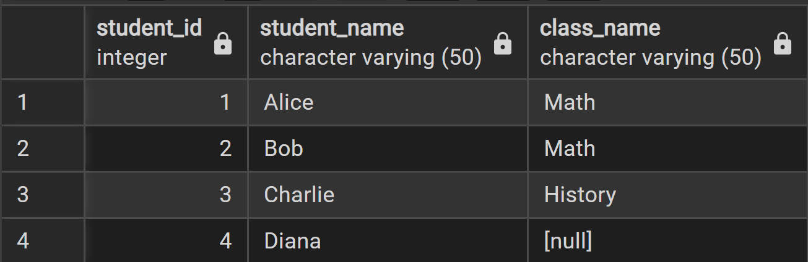
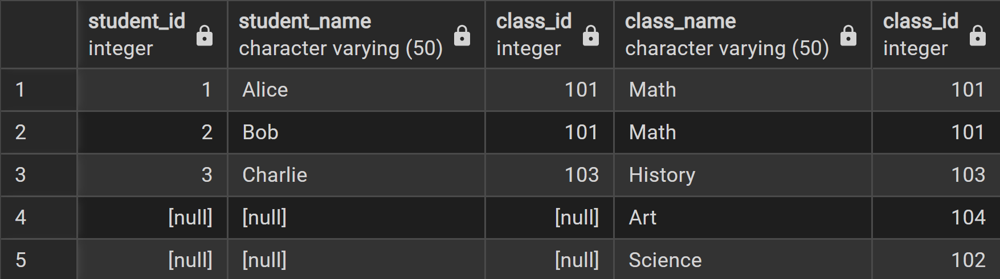
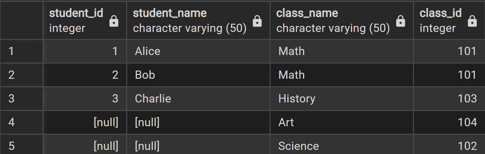
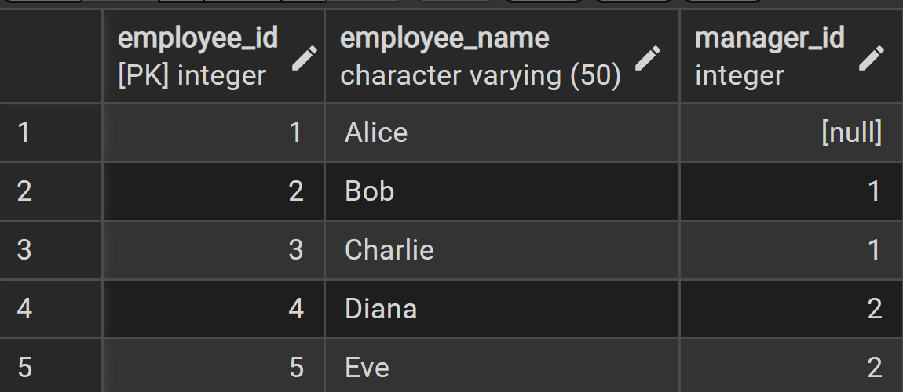
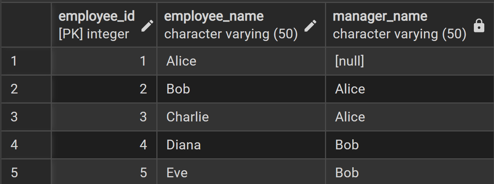

## 3. SQL Magic: Combining, Summarizing, and Renaming Data (Joins, Aggregate Functions, Aliases, and Self-Joins)

SQL is like a special language you use to ask questions to your database. It has many powerful commands that help you get exactly the information you need, combine data from different lists, summarize numbers, and even give temporary nicknames to things.

### What are Joins?

Imagine you have two separate tables of information. 

<p align="center">

</p>

Table A (Customer) has `customer_id` and `customer_name`. Table B (Orders) has `order_id` and `customer_id` (to show who placed the order). If you want to see the `customer_name` next to their `order_id`, you need to combine these two tables. This is what `JOIN` operations do.

<p align="center">

</p>


A `JOIN` connects rows from two or more tables based on a common column between them (like `customer_id`).

*Code to test:*


```SQL
-- Customers Table
CREATE TABLE Customers (
    customer_id INT PRIMARY KEY,
    customer_name VARCHAR(50)
);

SELECT * FROM Customers;

INSERT INTO Customers (customer_id, customer_name) VALUES
(1, 'Alice'),
(2, 'Bob'),
(3, 'Charlie'),
(4, 'Diana');   -- Diana has not placed any orders yet

SELECT * FROM Customers;

-- Orders Table (NO foreign key this time to allow orphan orders)
CREATE TABLE Orders (
    order_id INT PRIMARY KEY,
    customer_id INT   -- not enforced as FK
);

SELECT * FROM Orders;

INSERT INTO Orders (order_id, customer_id) VALUES
(101, 1), -- Alice placed an order
(102, 2), -- Bob placed an order
(103, 2), -- Bob placed another order
(104, 5); -- Orphan order (no matching customer)

SELECT * FROM Orders;

-- Join Operation 

SELECT 
    c.customer_id, 
    c.customer_name, 
    o.order_id
FROM Customers AS c
INNER JOIN Orders AS o
    ON c.customer_id = o.customer_id;
```


#### Types of Joins (The Most Common Ones):

1.  **INNER JOIN: Only the Matches**
    *   This join is like finding common friends between two groups. It only shows you rows where there is a match in *both* tables.
    *   If a customer hasn't placed an order, or an order has a customer ID that doesn't exist in your customer list, they won't show up.

    *Analogy:* You have a list of students and a list of classes they are *currently* taking. 
    <p align="center">
    
    </p>
    
    With an `INNER JOIN` would *only* show you students who are actually enrolled in at least one class, and the classes they are in. Notice that Diana isn't shown nor Art as they don't have a match in *both* tables
    <p align="center">
    
    </p>


*Code to test:*

```sql
-- Students Table (each student linked directly to a class_id)
CREATE TABLE Students (
    student_id INT PRIMARY KEY,
    student_name VARCHAR(50),
    class_id INT   -- direct reference
);

INSERT INTO Students (student_id, student_name, class_id) VALUES
(1, 'Alice', 101),   -- Alice takes Math
(2, 'Bob', 101),     -- Bob takes Math
(3, 'Charlie', 103), -- Charlie takes History
(4, 'Diana', NULL);  -- Diana not enrolled in any class


-- Classes Table
CREATE TABLE Classes (
    class_id INT PRIMARY KEY,
    class_name VARCHAR(50)
);

INSERT INTO Classes (class_id, class_name) VALUES
(101, 'Math'),
(102, 'Science'),
(103, 'History'),
(104, 'Art'); -- no student enrolled

SELECT * FROM Students;
SELECT * FROM Classes;


SELECT 
    s.student_id,
    s.student_name,
    c.class_name
FROM Students s
INNER JOIN Classes c
    ON s.class_id = c.class_id;
```

2.  **LEFT JOIN (or LEFT OUTER JOIN): All from Left, Matches from Right**

    *Analogy:* You have a table of students and a table of classes they are *currently* taking. 
    <p align="center">
    
    </p>
    *   This join is like saying, "Show me everything from my first table (the 'left' table), and if they have a match in the second table (the 'right' table), show that too. If not, just leave the right side blank."

    <p align="center">
    
    </p>

    *   It returns all rows from the left table. If there's no match in the right table, you'll see `NULL` (empty) values for the columns from the right table.

    *Analogy:* Show me *all* students. If they are taking a class, show me the class. If they are not taking any classes, just show me the student and leave the class part empty.

    <p align="center">
    
    </p>


*Code to test:*

```SQL
    -- Students Table (each student linked directly to a class_id)
CREATE TABLE Students (
    student_id INT PRIMARY KEY,
    student_name VARCHAR(50),
    class_id INT   -- direct reference
);

INSERT INTO Students (student_id, student_name, class_id) VALUES
(1, 'Alice', 101),   -- Alice takes Math
(2, 'Bob', 101),     -- Bob takes Math
(3, 'Charlie', 103), -- Charlie takes History
(4, 'Diana', NULL);  -- Diana not enrolled in any class


-- Classes Table
CREATE TABLE Classes (
    class_id INT PRIMARY KEY,
    class_name VARCHAR(50)
);

INSERT INTO Classes (class_id, class_name) VALUES
(101, 'Math'),
(102, 'Science'),
(103, 'History'),
(104, 'Art'); -- no student enrolled

SELECT * FROM Students;
SELECT * FROM Classes;


SELECT 
    s.student_id,
    s.student_name,
	s.class_id,
    c.class_name,
	c.class_id
FROM Students s
LEFT JOIN Classes c
ON s.class_id = c.class_id;
```

3.  **RIGHT JOIN (or RIGHT OUTER JOIN): All from Right, Matches from Left**
    *   This is the opposite of a `LEFT JOIN`.
    *   It returns all rows from the right table. If there's no match in the left table, you'll see `NULL` values for the columns from the left table.

    <p align="center">
    
    </p>

    *Analogy:* Show me *all* classes. If there are students in that class, show me the students. If a class has no students, just show me the class and leave the student part empty.
    <p align="center">
    
    </p>

*Code to test:*

```SQL
-- Students Table (each student linked directly to a class_id)
CREATE TABLE Students (
    student_id INT PRIMARY KEY,
    student_name VARCHAR(50),
    class_id INT   -- direct reference
);

INSERT INTO Students (student_id, student_name, class_id) VALUES
(1, 'Alice', 101),   -- Alice takes Math
(2, 'Bob', 101),     -- Bob takes Math
(3, 'Charlie', 103), -- Charlie takes History
(4, 'Diana', NULL);  -- Diana not enrolled in any class


-- Classes Table
CREATE TABLE Classes (
    class_id INT PRIMARY KEY,
    class_name VARCHAR(50)
);

INSERT INTO Classes (class_id, class_name) VALUES
(101, 'Math'),
(102, 'Science'),
(103, 'History'),
(104, 'Art'); -- no student enrolled

SELECT * FROM Students;
SELECT * FROM Classes;


SELECT 
    s.student_id,
    s.student_name,
	s.class_id,
    c.class_name,
	c.class_id
FROM Students s
Right JOIN Classes c
ON s.class_id = c.class_id;
```

---
#### Self-Join: Joining a Table to Itself

Sometimes, you need to compare rows *within the same table*. This is where a `SELF-JOIN` comes in. You join a table to itself, but you need to give it two different temporary names (aliases) so SQL knows you're treating it as two separate copies.
    <p align="center">
    
    </p>

*Analogy:* Imagine you have a list of employees, and each employee has a `manager_id` that points to another `employee_id` in the same table. You want to find out who reports to whom. You would join the `Employees` table to itself, once for the employee and once for their manager.
    <p align="center">
    
    </p>
(Alice is CEO → no manager. Others map correctly to their managers.)

*Code to test:*

```SQL
-- 4. SELF-JOIN Analogy
-- 👉 Employees and their managers

-- Employees Table
CREATE TABLE Employees (
    employee_id INT PRIMARY KEY,
    employee_name VARCHAR(50),
    manager_id INT   -- references another employee
);

INSERT INTO Employees (employee_id, employee_name, manager_id) VALUES
(1, 'Alice', NULL),   -- Alice is the CEO, no manager
(2, 'Bob', 1),        -- Bob reports to Alice
(3, 'Charlie', 1),    -- Charlie reports to Alice
(4, 'Diana', 2),      -- Diana reports to Bob
(5, 'Eve', 2);        -- Eve reports to Bob

-- With a SELF-JOIN on employee_id = manager_id, you can get employee → manager relationships.

SELECT * FROM Employees;


SELECT 
    e.employee_id,
    e.employee_name,
    m.employee_name AS manager_name
FROM Employees e
LEFT JOIN Employees m
    ON e.manager_id = m.employee_id;
```


---

#### Aliases: Giving Nicknames

Aliases are temporary, shorter names you can give to tables or columns in your SQL query. They make your queries much easier to read and write, especially when you have long table or column names, or when you're doing a `SELF-JOIN`.

*   **Table Alias:** Instead of writing `Customers.customer_name`, you can give `Customers` a short nickname like `C` and then write `C.customer_name`.
    *   Example: `SELECT C.customer_name FROM Customers AS C;` (The `AS` keyword is optional but makes it clearer).
*   **Column Alias:** You can also rename a column in your query's result. This doesn't change the column name in the actual table, just how it appears in your results.
    *   Example: `SELECT customer_name AS FullName FROM Customers;` This will show the `customer_name` column as `FullName` in your results.

---

### Simple Examples: Joins and Aliases

Let's use some simple tables to see these joins and aliases in action.

**1. Setting up Tables in pgAdmin 4 (SQL)**

Open your pgAdmin 4 Query Tool and run these commands to create and fill our example tables.

```sql
-- Drop tables if they exist to start fresh (optional, for testing)
DROP TABLE IF EXISTS Orders;
DROP TABLE IF EXISTS Customers;
DROP TABLE IF EXISTS Employees_SelfJoin;

-- Customers Table
CREATE TABLE Customers (
    customer_id INT PRIMARY KEY,
    customer_name VARCHAR(100) NOT NULL
);

INSERT INTO Customers (customer_id, customer_name) VALUES
(1, 'Alice'),
(2, 'Bob'),
(3, 'Charlie');

-- Orders Table
CREATE TABLE Orders (
    order_id INT PRIMARY KEY,
    customer_id INT, -- This is our Foreign Key to Customers
    order_date DATE,
    FOREIGN KEY (customer_id) REFERENCES Customers(customer_id)
);

INSERT INTO Orders (order_id, customer_id, order_date) VALUES
(101, 1, '2023-01-10'), -- Alice's order
(102, 1, '2023-01-15'), -- Alice's second order
(103, 2, '2023-02-01'), -- Bob's order
(104, NULL, '2023-02-05'); -- An order with no customer (maybe a guest order)

-- Employees for Self-Join Example
CREATE TABLE Employees_SelfJoin (
    employee_id INT PRIMARY KEY,
    employee_name VARCHAR(100) NOT NULL,
    manager_id INT -- This will point to another employee_id in the same table
);

INSERT INTO Employees_SelfJoin (employee_id, employee_name, manager_id) VALUES
(1, 'John Doe', NULL), -- John is the CEO, no manager
(2, 'Jane Smith', 1), -- Jane reports to John
(3, 'Peter Jones', 1), -- Peter reports to John
(4, 'Mary Brown', 2); -- Mary reports to Jane
```

#### Running Join Queries in pgAdmin 4

**INNER JOIN Example:** Show customers who have placed orders.

```sql
SELECT
    C.customer_name, -- Using alias C for Customers
    O.order_id,
    O.order_date
FROM
    Customers AS C
INNER JOIN
    Orders AS O ON C.customer_id = O.customer_id;
```

**LEFT JOIN Example:** Show all customers, and their orders if they have any.

```sql
SELECT
    C.customer_name,
    O.order_id,
    O.order_date
FROM
    Customers AS C
LEFT JOIN
    Orders AS O ON C.customer_id = O.customer_id;
```

**RIGHT JOIN Example:** Show all orders, and the customer who placed them if known.

```sql
SELECT
    C.customer_name,
    O.order_id,
    O.order_date
FROM
    Customers AS C
RIGHT JOIN
    Orders AS O ON C.customer_id = O.customer_id;
```

**SELF-JOIN Example:** Find employees and their managers.

```sql
SELECT
    E.employee_name AS Employee,
    M.employee_name AS Manager
FROM
    Employees_SelfJoin AS E
LEFT JOIN -- Using LEFT JOIN to include employees who don't have a manager (like the CEO)
    Employees_SelfJoin AS M ON E.manager_id = M.employee_id;
```

**Column Alias Example:** Rename columns in the output.

```sql
SELECT
    customer_name AS CustomerFullName,
    order_id AS OrderNumber
FROM
    Customers
JOIN
    Orders ON Customers.customer_id = Orders.customer_id;
```

**2. Checking Joins with Node.js**

Here is how you can create these tables and check the joins using Node.js.

```javascript
import { setupDatabase } from './db_setup.js';

async function createTablesForJoins(client) {
  await client.query(`
    DROP TABLE IF EXISTS Orders CASCADE;
    DROP TABLE IF EXISTS Customers CASCADE;
    DROP TABLE IF EXISTS Employees_SelfJoin CASCADE;

    CREATE TABLE Customers (
        customer_id INT PRIMARY KEY,
        customer_name VARCHAR(100) NOT NULL
    );
    INSERT INTO Customers (customer_id, customer_name) VALUES
    (1, 'Alice'),
    (2, 'Bob'),
    (3, 'Charlie');

    CREATE TABLE Orders (
        order_id INT PRIMARY KEY,
        customer_id INT,
        order_date DATE,
        FOREIGN KEY (customer_id) REFERENCES Customers(customer_id)
    );
    INSERT INTO Orders (order_id, customer_id, order_date) VALUES
    (101, 1, '2023-01-10'),
    (102, 1, '2023-01-15'),
    (103, 2, '2023-02-01'),
    (104, NULL, '2023-02-05');

    CREATE TABLE Employees_SelfJoin (
        employee_id INT PRIMARY KEY,
        employee_name VARCHAR(100) NOT NULL,
        manager_id INT
    );
    INSERT INTO Employees_SelfJoin (employee_id, employee_name, manager_id) VALUES
    (1, 'John Doe', NULL),
    (2, 'Jane Smith', 1),
    (3, 'Peter Jones', 1),
    (4, 'Mary Brown', 2);
  `);
  console.log('Tables for joins created and populated.');
}

async function getInnerJoin(client) {
    console.log('\n--- INNER JOIN: Customers with Orders ---');
    const res = await client.query(`SELECT C.customer_name, O.order_id, O.order_date FROM Customers AS C INNER JOIN Orders AS O ON C.customer_id = O.customer_id;`);
    res.rows.forEach(row => console.log(row));
}

async function getLeftJoin(client) {
    console.log('\n--- LEFT JOIN: All Customers and their Orders ---');
    const res = await client.query(`SELECT C.customer_name, O.order_id, O.order_date FROM Customers AS C LEFT JOIN Orders AS O ON C.customer_id = O.customer_id;`);
    res.rows.forEach(row => console.log(row));
}

async function getRightJoin(client) {
    console.log('\n--- RIGHT JOIN: All Orders and their Customers ---');
    const res = await client.query(`SELECT C.customer_name, O.order_id, O.order_date FROM Customers AS C RIGHT JOIN Orders AS O ON C.customer_id = O.customer_id;`);
    res.rows.forEach(row => console.log(row));
}

async function getSelfJoin(client) {
    console.log('\n--- SELF JOIN: Employees and their Managers ---');
    const res = await client.query(`SELECT E.employee_name AS Employee, M.employee_name AS Manager FROM Employees_SelfJoin AS E LEFT JOIN Employees_SelfJoin AS M ON E.manager_id = M.employee_id;`);
    res.rows.forEach(row => console.log(row));
}

async function runAllJoinChecks() {
  let client;
  try {
    client = await setupDatabase(true);
    await createTablesForJoins(client);
    await getInnerJoin(client);
    await getLeftJoin(client);
    await getRightJoin(client);
    await getSelfJoin(client);
  } catch (error) {
    console.error('An error occurred:', error);
  } finally {
    if (client) {
      await client.end();
      console.log('Disconnected from "demo_db".');
    }
  }
}

runAllJoinChecks();
```