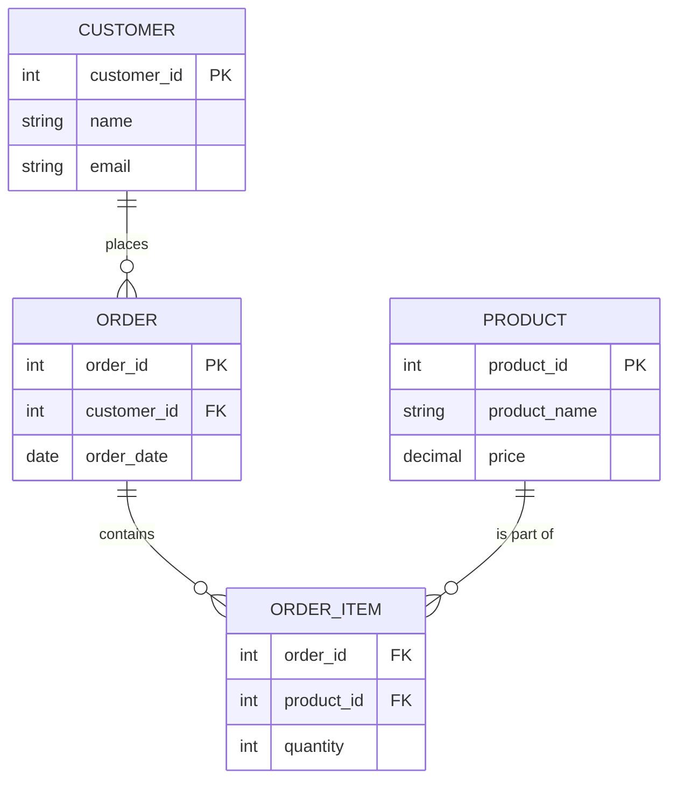

## 5. Domain Modeling (ERD - Entity-Relationship Diagram): Drawing Your Database Plan

Before you start building a house, you draw a blueprint, right? It shows where the rooms are, how they connect, and where the doors and windows go. Designing a database is similar! We use something called **Domain Modeling** to plan it out, and a **Entity-Relationship Diagram (ERD)** is our blueprint.

### What is Domain Modeling and ERD?

**Domain Modeling** is just a fancy way of saying: figuring out what information you need to store in your database and how all those pieces of information are connected. It helps you understand the "world" your database will live in.

An **Entity-Relationship Diagram (ERD)** is a picture (a diagram) that shows this plan. It uses simple shapes and lines to represent:

1.  **Entities (The "Things"):**
    *   These are the main "things" or categories of information you want to store. Think of them as the nouns in your system.
    *   *Examples:* `Customer`, `Product`, `Order`, `Student`, `Course`.
    *   In an ERD, entities are usually drawn as **rectangles**.

2.  **Attributes (The "Details"):**
    *   These are the specific pieces of information or details that describe an entity. Think of them as the adjectives for your nouns.
    *   *Examples:* For a `Customer` entity, attributes might be `customer_id`, `name`, `address`, `phone_number`.
    *   Attributes are often shown as **ovals** connected to their entity.
    *   A very special attribute is the **Primary Key** (which we learned about earlier!). It uniquely identifies each entity. In diagrams, it's often underlined.

3.  **Relationships (The "Connections"):**
    *   These show how entities are linked to each other. Think of them as the verbs that connect your nouns.
    *   *Examples:* A `Customer` *places* an `Order`; a `Student` *enrolls in* a `Course`.
    *   Relationships are typically drawn as **diamonds** connecting the related entities.
    *   **Cardinality ("How Many"):** This is super important! It tells us *how many* of one entity can be connected to *how many* of another. We use special symbols on the lines to show this. We already talked about these in the "Relationships" section:
        *   **One-to-One (1:1):** One of A connects to one of B.
        *   **One-to-Many (1:M):** One of A connects to many of B.
        *   **Many-to-Many (M:N):** Many of A connect to many of B (this needs a special linking table in the middle).

### Simple Example: A Small Online Shop ERD

Let's plan a very simple online shop database.

**What are our main "things" (Entities)?**
*   `Customer`: People who buy things.
*   `Product`: The items we sell.
*   `Order`: What a customer buys.

**What details (Attributes) do they have?**
*   `Customer`: `customer_id` (PK), `name`, `email`.
*   `Product`: `product_id` (PK), `product_name`, `price`.
*   `Order`: `order_id` (PK), `customer_id` (FK), `order_date`.

**How are they connected (Relationships)?**
*   A `Customer` *places* an `Order`. (One `Customer` can place many `Orders`, but each `Order` is placed by only one `Customer`.) This is a **One-to-Many (1:M)** relationship.
*   An `Order` *contains* `Products`. (One `Order` can contain many `Products`, and one `Product` can be in many `Orders`.) This is a **Many-to-Many (M:N)** relationship. Remember, for M:N, we need a linking table! Let's call it `Order_Items`.

**`Order_Items` (Linking Table):**
*   `order_id` (FK, part of Composite PK)
*   `product_id` (FK, part of Composite PK)
*   `quantity` (how many of that product in the order)

**ERD Representation (Conceptual - using a simple text-based diagram for clarity):**

### Exercise

Design an ERD for a simple **Blog Platform** with the following needs:

*   `Authors` write `Posts`.
*   Each `Post` can have many `Comments`.
*   `Posts` can have multiple `Tags` (like 
    `Technology`, `Travel`, etc.). A `Tag` can be applied to many `Posts`.

Identify the entities, their important attributes (including primary keys), and the relationships between them, along with their cardinalities. You can describe it in text or draw a simple diagram.

### The Main Idea (Essence)

Domain modeling and ERDs are like drawing a map before you start building. They help you clearly see what information you need to store in your database and how all those pieces of information are connected. By planning with ERDs, you make sure your database is well-organized, easy to understand, and works efficiently!