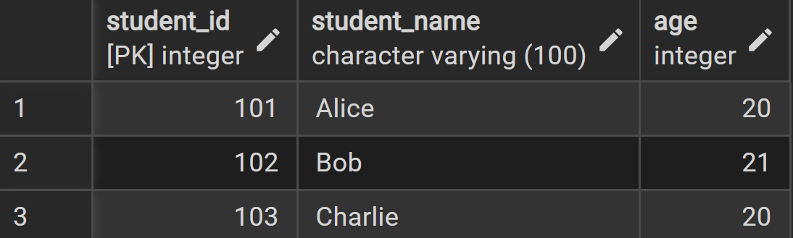
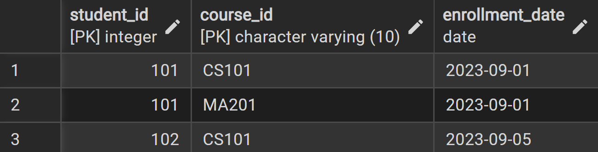
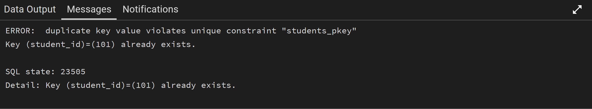
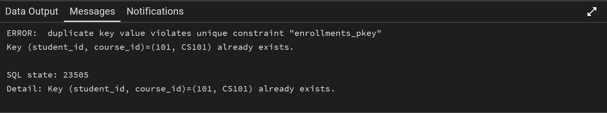
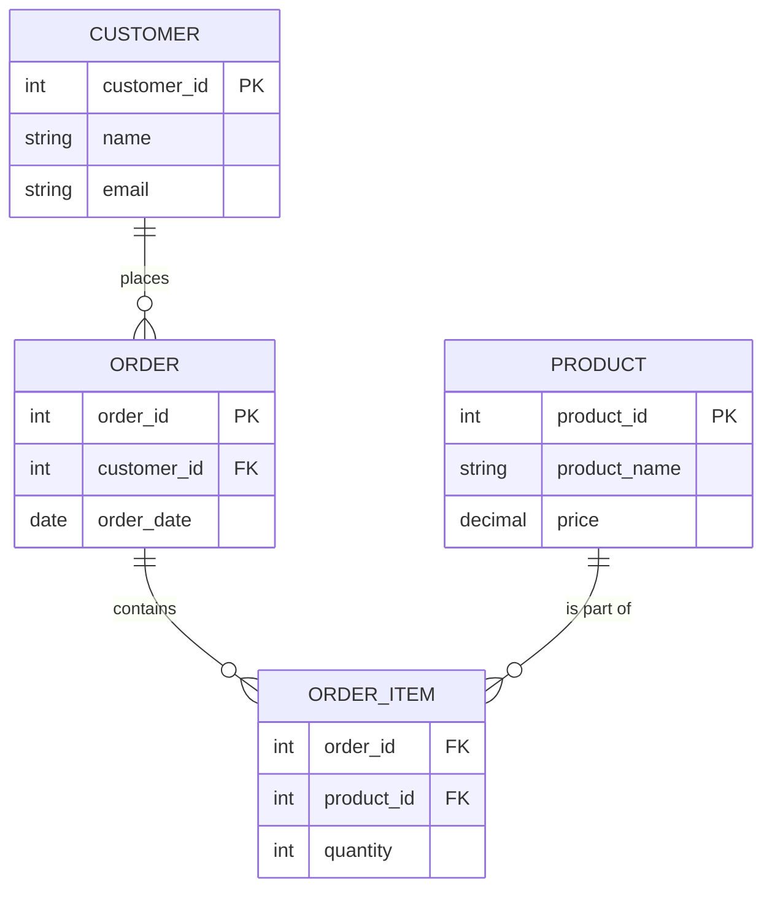

# Databases Week 2: Easy Guide to Data Management (Updated)

Hello! This week, we're going to learn some super important ideas about how databases work. Don't worry if you're new to this – I'll explain everything in a very simple way, like we're just chatting. We'll use lots of easy examples you can try yourself, both in a tool called pgAdmin 4 (for database commands) and with Node.js (for writing code that talks to the database), using the specific connection method you provided.

## 0. Talking to Databases: It's Like Sending a Letter (Asynchronous)

Imagine you send a letter to a friend. You don't just stand by the mailbox waiting for their reply, right? You go do other things, and check for the reply later. Talking to a database works a bit like that. It's called "asynchronous" communication.

### What does "Asynchronous" mean?

When your computer program (like a Node.js app) asks the database to do something (like find some information or save new data), it doesn't just stop and wait. It sends the request and then immediately goes on to do other tasks. This is good because your program doesn't get stuck.

But sometimes, you need things to happen in a certain order. For example, you can't put new data into a table *before* you create the table itself. In these cases, your program needs to wait for the database to finish one task before starting the next.

In Node.js (and JavaScript), we use special words like `async` and `await` to help us manage this waiting game. They make sure things happen in the right order without making your whole program freeze.

*   `async`: You put this word before a function to tell JavaScript, "Hey, this function might take some time to finish, and it will give me a 'promise' that it will eventually complete."
*   `await`: You put this word before a task that returns a promise. It tells JavaScript, "Wait here until this task is completely done before moving on."

### Simple Example (Node.js)

Let's say you want to:
1.  Create a new table in your database.
2.  Then, put some data into that new table.

If you try to put data in before the table is ready, you'll get an error! `async` and `await` help us avoid this.

Here's a very simple Node.js example using the connection method you provided. Imagine `createTableInDatabase()` and `insertDataIntoDatabase()` are functions that talk to your database. They are `async` because talking to a database takes time.

```javascript
import { setupDatabase } from './connectDatabase.js';

async function createTableInDatabase(client) {
  console.log("Step 1: Starting to create the table...");
  await client.query(`
    CREATE TABLE IF NOT EXISTS my_test_table (
      id SERIAL PRIMARY KEY,
      message TEXT
    );
  `);
  console.log("Step 1: Table is now created!");
}

async function insertDataIntoDatabase(client) {
  console.log("Step 2: Starting to insert data...");
  await client.query(`
    INSERT INTO my_test_table (message) VALUES ('Hello from Node.js!');
  `);
  console.log("Step 2: Data is now inserted!");
}

export async function runMyDatabaseTasks() {
  let client; // declare here for finally
  try {
    client = await setupDatabase(true); // drops and creates a fresh DB
    console.log("Starting all database tasks...");

    await createTableInDatabase(client);
    await insertDataIntoDatabase(client);

    console.log("✅ All database tasks finished!");
  } catch (error) {
    console.error('❌ An error occurred:', error);
  } finally {
    if (client) {
      await client.end();
      console.log('🔒 Disconnected from "demo_db".');
    }
  }
}

// Run immediately if this is the entry file
runMyDatabaseTasks();
```

**How to run this Node.js example:**
1. Make sure you're in study-guide folder.
2. Open the terminal and install dependencies:
   ```bash
   npm install
3. Open your terminal or command prompt and run: 
   ```bash
   node `demo.js`
4.  Go to pgAdmin 4 and refresh Databases you shall find there the `demo` database with the my_test_table table created inside (schemas/tables) with value of `Hello from Node.js!`.

You will also see the messages appear in the correct order in the terminal, showing how `await` makes sure one step finishes before the next one starts.

### Exercise

1.  **Try it yourself:** In the `demo.js` file, what would happen if you swapped the order of `createTableInDatabase(client)` and `insertDataIntoDatabase(client)`? Try it and see what error you get.

### The Main Idea (Essence)

Talking to databases often involves waiting, but your program doesn't have to stop completely. `async` and `await` are like traffic cops for your code, making sure database tasks happen in the right order, especially when one task depends on another. This keeps your program running smoothly and efficiently.


## 1. Identifiers: Primary Key, Foreign Key, and Composite Key

Imagine you have a big collection of things, like your favorite toys, books, or even friends. How do you tell them apart? You probably use a special name or a unique feature. In databases, we do something similar with "identifiers" or "keys." They help us find and connect different pieces of information.

### What are Identifiers (Keys)?

Think of a database as a bunch of organized lists, like spreadsheets. Each list (which we call a "table") holds information about one type of thing, like `Students` or `Courses`. To make sure every item in our list is unique and to link related lists together, we use special columns called keys.

1.  **Primary Key (PK): Your Item's Unique ID**
    *   A Primary Key is like a special ID number for each row (each item) in your table. It must be unique for every single item, and it can never be empty.
    *   **Rule 1: Always Unique:** No two items in your list can have the same Primary Key. Just like no two people have the same passport number.
    *   **Rule 2: Never Empty:** A Primary Key can never be blank or unknown. It must always have a value.
    *   **Only One Per Table:** Each table can have only one Primary Key.

    *Example:* In a `Students` table, `student_id` would be a perfect Primary Key.

2.  **Foreign Key (FK): The Connector**
    *   A Foreign Key is a column in one table that points to the Primary Key in another table. It's how we connect related information between different lists.
    *   Think of it as a bridge that links two tables together. It shows a relationship.
    *   The value in a Foreign Key column must either match a value in the other table's Primary Key, or it can be empty (if you allow it).

    *Example:* If you have an `Orders` table, it might have a `customer_id` column. This `customer_id` would be a Foreign Key, linking each order back to the `customer_id` (Primary Key) in the `Customers` table.

3.  **Composite Key: When One ID Isn't Enough**
    *   Sometimes, a single column isn't enough to make a row truly unique. In these cases, we use a combination of two or more columns together to form a unique ID. This combination is called a Composite Key.
    *   Each part of the Composite Key might not be unique on its own, but when you put them together, they become unique.

    *Example:* In a table that tracks `Enrollments` (which student is taking which course), neither `student_id` nor `course_id` might be unique on their own (a student can take many courses, a course can have many students). But the combination `(student_id, course_id)` would uniquely identify a specific student's enrollment in a specific course.

### Simple Example: Students and Courses

Let's use our `Students` and `Courses` example to see these keys in action.

**1. Setting up Tables in pgAdmin 4 (SQL)**

First, let's create our tables in pgAdmin 4. You can open pgAdmin 4, connect to your database, and then open a Query Tool to run these commands.

```sql
-- Create the Students table
CREATE TABLE Students (
    student_id INT PRIMARY KEY, -- This is our Primary Key! Unique and not empty.
    student_name VARCHAR(100) NOT NULL,
    age INT
);
```


```sql

-- Insert some sample students
INSERT INTO Students (student_id, student_name, age) VALUES
(101, 'Alice', 20),
(102, 'Bob', 21),
(103, 'Charlie', 20);
```





```sql
-- Create the Courses table
CREATE TABLE Courses (
    course_id VARCHAR(10) PRIMARY KEY, -- Another Primary Key!
    course_name VARCHAR(100) NOT NULL,
    instructor VARCHAR(100)
);
```


```sql
-- Insert some sample courses
INSERT INTO Courses (course_id, course_name, instructor) VALUES
('CS101', 'Intro to Computer Science', 'Mr. Smith'),
('MA201', 'Calculus I', 'Ms. Jones');
```


```sql
-- Create the Enrollments table (this will use Foreign Keys and a Composite Key)
CREATE TABLE Enrollments (
    student_id INT, -- This will be a Foreign Key
    course_id VARCHAR(10), -- This will also be a Foreign Key
    enrollment_date DATE,
    -- Here, (student_id, course_id) together form the Composite Primary Key
    PRIMARY KEY (student_id, course_id),
    -- Define Foreign Key relationships
    FOREIGN KEY (student_id) REFERENCES Students(student_id),
    FOREIGN KEY (course_id) REFERENCES Courses(course_id)
);
```


```sql
-- Insert some sample enrollments
INSERT INTO Enrollments (student_id, course_id, enrollment_date) VALUES
(101, 'CS101', '2023-09-01'),
(101, 'MA201', '2023-09-01'),
(102, 'CS101', '2023-09-05');
```





```sql
-- Try to insert a student with an existing student_id (will fail because of PRIMARY KEY constraint)
INSERT INTO Students (student_id, student_name, age) VALUES (101, 'David', 22);
```





* Why the error:

* student_id is a Primary Key.

* Primary Keys must be unique. You already have a student with student_id = 101.

* Takeaway:

* You cannot have two rows with the same Primary Key. Each student must have a unique ID.


```sql
-- Try to insert an enrollment for a student that doesn't exist (will fail because of FOREIGN KEY constraint)
INSERT INTO Enrollments (student_id, course_id, enrollment_date) VALUES (999, 'CS101', '2023-09-10');
```


* Why the error:

* student_id in Enrollments is a Foreign Key pointing to Students.

* There is no student with ID 999 in the Students table.

* Takeaway:

* Foreign Keys make sure that the student or course actually exists before you can link it. You can't enroll a student that doesn’t exist.


```sql
-- Try to insert the exact same enrollment again (will fail because of COMPOSITE PRIMARY KEY constraint)
INSERT INTO Enrollments (student_id, course_id, enrollment_date) VALUES (101, 'CS101', '2023-09-01');
```





* Why the error:

* Enrollments has a Composite Primary Key (student_id, course_id).

* This means that the same student cannot be enrolled in the same course twice.

* Takeaway:

* Composite Primary Keys prevent duplicate relationships. One student can’t be enrolled in the same course more than once.


```mermaid
erDiagram
    STUDENTS ||--o{ ENROLLMENTS : has
    COURSES ||--o{ ENROLLMENTS : has

    STUDENTS {
        INT student_id PK
        VARCHAR student_name
        INT age
    }

    COURSES {
        VARCHAR course_id PK
        VARCHAR course_name
        VARCHAR instructor
    }

    ENROLLMENTS {
        INT student_id FK
        VARCHAR course_id FK
        DATE enrollment_date
        PK(student_id, course_id)
    }
    ```


- **Students**: Each student has a unique `student_id`.
- **Courses**: Each course has a unique `course_id`.
- **Enrollments**: Links students to courses.  
  - Composite Primary Key = `(student_id, course_id)` → ensures a student cannot enroll in the same course twice.  
  - Foreign Keys → make sure `student_id` exists in Students and `course_id` exists in Courses.

---

## ✅ Summary of lessons

| Constraint Type         | What it does                          | Error happens when…                       | Takeaway                                      |
|-------------------------|--------------------------------------|------------------------------------------|-----------------------------------------------|
| Primary Key             | Unique identifier for a row          | You try to insert a duplicate            | Each row must have a unique ID               |
| Foreign Key             | Links to another table               | You reference something that doesn't exist | You can only link to valid rows             |
| Composite Primary Key   | Unique combination of two or more columns | You insert the same combination twice   | Prevents duplicate relationships            |


**2. Checking Data with Node.js**

To see how Node.js interacts with these tables, refere to refer to `js-code` folder.

```

**How to run this Node.js example:**
1.  Go to `js-code` folder and open a JS file named `CheckingDataWithNode.js`.
2.  Open your terminal or command prompt.
3.  Navigate to the `js-code` folder where the file is saved.
4.  Make sure you first drop demo_db database in pgAdmin 4.
4.  Run the command: `node CheckingDataWithNode.js`

You will see the data from your `Students`, `Courses` and `Enrollments` tables printed in your console, showing how the keys organize the data.

### Exercise

3.  **Node.js:** Modify `CheckingDataWithNode.js` to also fetch and print data from the `Courses` table. (Hint: Add a new `async function checkCourses(client)` and call it in `runChecks()`).

### The Main Idea (Essence)

Keys are like the unique IDs and connectors in your database. **Primary Keys** give each item a unique, never-empty ID. **Foreign Keys** link items between different tables. **Composite Keys** use a combination of columns to create a unique ID when one column isn't enough. They are super important for keeping your data organized and connected!


## 2. Relationships: How Tables Talk to Each Other

Databases are not just random lists; they are designed to store information that is connected. "Relationships" show how data in one table is linked to data in another table. Understanding these links is super important for building a good database.

### What are Relationships?

Imagine you have different groups of friends. Some friends are in your family, some are from school, and some are from your sports team. You have different ways of relating to each group. Databases work similarly, connecting different groups of information (tables) in specific ways.

We describe these connections using something called **cardinality**, which simply means "how many" instances of one thing are linked to "how many" instances of another thing.

There are three main types of relationships:

1.  **One-to-One (1:1): A Perfect Pair**
    *   This means one item in Table A is linked to exactly one item in Table B, and one item in Table B is linked to exactly one item in Table A.
    *   It's like a perfect pair. For example, one person has one passport, and that passport belongs to only one person.
    *   We don't use this type of relationship very often because if two things are always perfectly paired, you could often just put them in the same table. But sometimes it's useful for special cases, like keeping sensitive information separate.

    *Example:* An `Employee` has one `Company Car`, and that `Company Car` is used by only one `Employee`.

2.  **One-to-Many (1:M) or Many-to-One (M:1): One Boss, Many Workers**
    *   This is the most common type of relationship you'll see.
    *   **One-to-Many:** One item in Table A can be linked to many items in Table B. But each item in Table B is linked to only one item in Table A.
    *   **Many-to-One:** This is just looking at the same relationship from the other side. Many items in Table B are linked to one item in Table A.
    *   We usually make this connection using a **Foreign Key**. The unique ID (Primary Key) from the "one" side of the relationship is put into the "many" side table as a Foreign Key.

    *Example:* A `Department` (the "one" side) can have many `Employees` (the "many" side). But each `Employee` works for only one `Department`.

3.  **Many-to-Many (M:N): Many Friends, Many Groups**
    *   This means one item in Table A can be linked to many items in Table B, AND one item in Table B can also be linked to many items in Table A.
    *   It's like a student taking many courses, and a course having many students.
    *   You can't directly link two tables in a Many-to-Many way. Instead, we create a special new table in the middle, often called a **junction table** or **linking table**. This junction table has Foreign Keys from both of the original tables.

    *Example:* A `Student` can enroll in many `Courses`, and a `Course` can have many `Students`.

### Simple Examples: How to Build and See Relationships

Let's build some simple tables and see how these relationships work.

**1. Setting up Tables in pgAdmin 4 (SQL)**

We'll create tables for a simple school system. Open your pgAdmin 4 Query Tool and run these commands.

```sql
-- Drop tables if they exist to start fresh (optional, for testing)
DROP TABLE IF EXISTS StudentCourses;
DROP TABLE IF EXISTS Students;
DROP TABLE IF EXISTS Courses;
DROP TABLE IF EXISTS EmployeeCars;
DROP TABLE IF EXISTS Employees;
DROP TABLE IF EXISTS Departments;

-- 1. One-to-One Example: Employees and Company Cars
-- Each employee gets one car, and each car belongs to one employee.

CREATE TABLE Employees (
    employee_id INT PRIMARY KEY, -- Unique ID for each employee
    employee_name VARCHAR(100) NOT NULL
);

CREATE TABLE EmployeeCars (
    car_id INT PRIMARY KEY, -- Unique ID for each car
    employee_id INT UNIQUE, -- This is the Foreign Key, linking to Employees.employee_id
                            -- UNIQUE constraint ensures only one car per employee (1:1)
    car_model VARCHAR(100),
    FOREIGN KEY (employee_id) REFERENCES Employees(employee_id)
);

INSERT INTO Employees (employee_id, employee_name) VALUES
(1, 'Alice'),
(2, 'Bob');

INSERT INTO EmployeeCars (car_id, employee_id, car_model) VALUES
(101, 1, 'Toyota Camry'),
(102, 2, 'Honda Civic');

-- 2. One-to-Many Example: Departments and Employees
-- One department has many employees, but each employee works for only one department.

CREATE TABLE Departments (
    dept_id INT PRIMARY KEY, -- Unique ID for each department
    dept_name VARCHAR(100) NOT NULL
);

-- We already have an Employees table, let's add a dept_id to it
ALTER TABLE Employees
ADD COLUMN dept_id INT,
ADD CONSTRAINT fk_dept FOREIGN KEY (dept_id) REFERENCES Departments(dept_id);

INSERT INTO Departments (dept_id, dept_name) VALUES
(10, 'Sales'),
(20, 'Marketing'),
(30, 'HR');

-- Update employees to assign them to departments
UPDATE Employees SET dept_id = 10 WHERE employee_id = 1; -- Alice in Sales
UPDATE Employees SET dept_id = 20 WHERE employee_id = 2; -- Bob in Marketing
INSERT INTO Employees (employee_id, employee_name, dept_id) VALUES (3, 'Charlie', 10); -- Charlie in Sales

-- 3. Many-to-Many Example: Students and Courses
-- One student can take many courses, and one course can have many students.

CREATE TABLE Students (
    student_id INT PRIMARY KEY,
    student_name VARCHAR(100) NOT NULL
);

CREATE TABLE Courses (
    course_id VARCHAR(10) PRIMARY KEY,
    course_name VARCHAR(100) NOT NULL
);

-- This is our JUNCTION TABLE for Many-to-Many relationship
CREATE TABLE StudentCourses (
    student_id INT,
    course_id VARCHAR(10),
    PRIMARY KEY (student_id, course_id), -- Composite Primary Key
    FOREIGN KEY (student_id) REFERENCES Students(student_id),
    FOREIGN KEY (course_id) REFERENCES Courses(course_id)
);

INSERT INTO Students (student_id, student_name) VALUES
(101, 'Alice Student'),
(102, 'Bob Student');

INSERT INTO Courses (course_id, course_name) VALUES
('MATH101', 'Basic Math'),
('ENG101', 'English Writing');

INSERT INTO StudentCourses (student_id, course_id) VALUES
(101, 'MATH101'), -- Alice takes Math
(101, 'ENG101'),  -- Alice also takes English
(102, 'MATH101');  -- Bob takes Math
```

**2. Checking Relationships with Node.js**

Here is how you can create these tables and check the relationships using Node.js.

```javascript
import { setupDatabase } from './db_setup.js';

async function createTables(client) {
  await client.query(`
    DROP TABLE IF EXISTS StudentCourses CASCADE;
    DROP TABLE IF EXISTS Students CASCADE;
    DROP TABLE IF EXISTS Courses CASCADE;
    DROP TABLE IF EXISTS EmployeeCars CASCADE;
    DROP TABLE IF EXISTS Employees CASCADE;
    DROP TABLE IF EXISTS Departments CASCADE;

    CREATE TABLE Employees (employee_id INT PRIMARY KEY, employee_name VARCHAR(100) NOT NULL);
    CREATE TABLE EmployeeCars (car_id INT PRIMARY KEY, employee_id INT UNIQUE, car_model VARCHAR(100), FOREIGN KEY (employee_id) REFERENCES Employees(employee_id));
    INSERT INTO Employees (employee_id, employee_name) VALUES (1, 'Alice'), (2, 'Bob');
    INSERT INTO EmployeeCars (car_id, employee_id, car_model) VALUES (101, 1, 'Toyota Camry'),(102, 2, 'Honda Civic');

    CREATE TABLE Departments (dept_id INT PRIMARY KEY, dept_name VARCHAR(100) NOT NULL);
    ALTER TABLE Employees ADD COLUMN dept_id INT, ADD CONSTRAINT fk_dept FOREIGN KEY (dept_id) REFERENCES Departments(dept_id);
    INSERT INTO Departments (dept_id, dept_name) VALUES (10, 'Sales'), (20, 'Marketing'), (30, 'HR');
    UPDATE Employees SET dept_id = 10 WHERE employee_id = 1;
    UPDATE Employees SET dept_id = 20 WHERE employee_id = 2;
    INSERT INTO Employees (employee_id, employee_name, dept_id) VALUES (3, 'Charlie', 10);

    CREATE TABLE Students (student_id INT PRIMARY KEY, student_name VARCHAR(100) NOT NULL);
    CREATE TABLE Courses (course_id VARCHAR(10) PRIMARY KEY, course_name VARCHAR(100) NOT NULL);
    CREATE TABLE StudentCourses (student_id INT, course_id VARCHAR(10), PRIMARY KEY (student_id, course_id), FOREIGN KEY (student_id) REFERENCES Students(student_id), FOREIGN KEY (course_id) REFERENCES Courses(course_id));
    INSERT INTO Students (student_id, student_name) VALUES (101, 'Alice Student'), (102, 'Bob Student');
    INSERT INTO Courses (course_id, course_name) VALUES ('MATH101', 'Basic Math'), ('ENG101', 'English Writing');
    INSERT INTO StudentCourses (student_id, course_id) VALUES (101, 'MATH101'), (101, 'ENG101'), (102, 'MATH101');
  `);
  console.log('Tables for relationships created and populated.');
}

async function getEmployeeCars(client) {
    console.log('\n--- Employee and Car (One-to-One) ---');
    const res = await client.query(`SELECT e.employee_name, ec.car_model FROM Employees e JOIN EmployeeCars ec ON e.employee_id = ec.employee_id;`);
    res.rows.forEach(row => console.log(row));
}

async function getEmployeesByDepartment(client) {
    console.log('\n--- Employees by Department (One-to-Many) ---');
    const res = await client.query(`SELECT e.employee_name, d.dept_name FROM Employees e LEFT JOIN Departments d ON e.dept_id = d.dept_id;`);
    res.rows.forEach(row => console.log(row));
}

async function getStudentCourses(client) {
    console.log('\n--- Student Enrollments (Many-to-Many) ---');
    const res = await client.query(`SELECT s.student_name, c.course_name FROM Students s JOIN StudentCourses sc ON s.student_id = sc.student_id JOIN Courses c ON sc.course_id = c.course_id;`);
    res.rows.forEach(row => console.log(row));
}

async function runAllRelationshipChecks() {
  let client;
  try {
    client = await setupDatabase(true);
    await createTables(client);
    await getEmployeeCars(client);
    await getEmployeesByDepartment(client);
    await getStudentCourses(client);
  } catch (error) {
    console.error("An error occurred:", error);
  } finally {
    if (client) {
      await client.end();
      console.log('Disconnected from "demo_db".');
    }
  }
}

runAllRelationshipChecks();
```

### Exercise

1.  **pgAdmin 4:** Try to insert a new employee into the `Employees` table without assigning them to a department (set `dept_id` to `NULL`). Then, try to insert an employee and assign them to `dept_id = 99` (a department that doesn't exist). What happens? Why?
2.  **pgAdmin 4:** Imagine a `Teachers` table and a `Subjects` table. A teacher can teach many subjects, and a subject can be taught by many teachers. How would you create the tables (including the junction table) to represent this Many-to-Many relationship in SQL?
3.  **Node.js:** Modify the `runAllRelationshipChecks` script to fetch and display all departments, even those that currently have no employees. (Hint: You might need to change the `JOIN` type in `getEmployeesByDepartment()`.)

### The Main Idea (Essence)

Relationships are the glue that connects different tables in your database. They define how information flows and links together. **One-to-One** is for unique pairs, **One-to-Many** is for a single item linked to multiple others, and **Many-to-Many** uses a special **junction table** to link multiple items on both sides. These relationships are key to building powerful and organized databases.


## 3. SQL Magic: Combining, Summarizing, and Renaming Data (Joins, Aggregate Functions, Aliases, and Self-Joins)

SQL is like a special language you use to ask questions to your database. It has many powerful commands that help you get exactly the information you need, combine data from different lists, summarize numbers, and even give temporary nicknames to things.

### What are Joins?

Imagine you have two separate lists of information. List A has `Customer IDs` and `Customer Names`. List B has `Order IDs` and `Customer IDs` (to show who placed the order). If you want to see the `Customer Name` next to their `Order ID`, you need to combine these two lists. This is what `JOIN` operations do.

A `JOIN` connects rows from two or more tables based on a common column between them (like `Customer ID`).

#### Types of Joins (The Most Common Ones):

1.  **INNER JOIN: Only the Matches**
    *   This join is like finding common friends between two groups. It only shows you rows where there is a match in *both* tables.
    *   If a customer hasn't placed an order, or an order has a customer ID that doesn't exist in your customer list, they won't show up.

    *Analogy:* You have a list of students and a list of classes they are *currently* taking. An `INNER JOIN` would only show you students who are actually enrolled in at least one class, and the classes they are in.

2.  **LEFT JOIN (or LEFT OUTER JOIN): All from Left, Matches from Right**
    *   This join is like saying, "Show me everyone from my first list (the 'left' table), and if they have a match in the second list (the 'right' table), show that too. If not, just leave the right side blank."
    *   It returns all rows from the left table. If there's no match in the right table, you'll see `NULL` (empty) values for the columns from the right table.

    *Analogy:* Show me *all* students. If they are taking a class, show me the class. If they are not taking any classes, just show me the student and leave the class part empty.

3.  **RIGHT JOIN (or RIGHT OUTER JOIN): All from Right, Matches from Left**
    *   This is the opposite of a `LEFT JOIN`.
    *   It returns all rows from the right table. If there's no match in the left table, you'll see `NULL` values for the columns from the left table.

    *Analogy:* Show me *all* classes. If there are students in that class, show me the students. If a class has no students, just show me the class and leave the student part empty.

#### Self-Join: Joining a Table to Itself

Sometimes, you need to compare rows *within the same table*. This is where a `SELF-JOIN` comes in. You join a table to itself, but you need to give it two different temporary names (aliases) so SQL knows you're treating it as two separate copies.

*Analogy:* Imagine you have a list of employees, and each employee has a `manager_id` that points to another `employee_id` in the same table. You want to find out who reports to whom. You would join the `Employees` table to itself, once for the employee and once for their manager.

#### Aliases: Giving Nicknames

Aliases are temporary, shorter names you can give to tables or columns in your SQL query. They make your queries much easier to read and write, especially when you have long table or column names, or when you're doing a `SELF-JOIN`.

*   **Table Alias:** Instead of writing `Customers.customer_name`, you can give `Customers` a short nickname like `C` and then write `C.customer_name`.
    *   Example: `SELECT C.customer_name FROM Customers AS C;` (The `AS` keyword is optional but makes it clearer).
*   **Column Alias:** You can also rename a column in your query's result. This doesn't change the column name in the actual table, just how it appears in your results.
    *   Example: `SELECT customer_name AS FullName FROM Customers;` This will show the `customer_name` column as `FullName` in your results.

### Simple Examples: Joins and Aliases

Let's use some simple tables to see these joins and aliases in action.

**1. Setting up Tables in pgAdmin 4 (SQL)**

Open your pgAdmin 4 Query Tool and run these commands to create and fill our example tables.

```sql
-- Drop tables if they exist to start fresh (optional, for testing)
DROP TABLE IF EXISTS Orders;
DROP TABLE IF EXISTS Customers;
DROP TABLE IF EXISTS Employees_SelfJoin;

-- Customers Table
CREATE TABLE Customers (
    customer_id INT PRIMARY KEY,
    customer_name VARCHAR(100) NOT NULL
);

INSERT INTO Customers (customer_id, customer_name) VALUES
(1, 'Alice'),
(2, 'Bob'),
(3, 'Charlie');

-- Orders Table
CREATE TABLE Orders (
    order_id INT PRIMARY KEY,
    customer_id INT, -- This is our Foreign Key to Customers
    order_date DATE,
    FOREIGN KEY (customer_id) REFERENCES Customers(customer_id)
);

INSERT INTO Orders (order_id, customer_id, order_date) VALUES
(101, 1, '2023-01-10'), -- Alice's order
(102, 1, '2023-01-15'), -- Alice's second order
(103, 2, '2023-02-01'), -- Bob's order
(104, NULL, '2023-02-05'); -- An order with no customer (maybe a guest order)

-- Employees for Self-Join Example
CREATE TABLE Employees_SelfJoin (
    employee_id INT PRIMARY KEY,
    employee_name VARCHAR(100) NOT NULL,
    manager_id INT -- This will point to another employee_id in the same table
);

INSERT INTO Employees_SelfJoin (employee_id, employee_name, manager_id) VALUES
(1, 'John Doe', NULL), -- John is the CEO, no manager
(2, 'Jane Smith', 1), -- Jane reports to John
(3, 'Peter Jones', 1), -- Peter reports to John
(4, 'Mary Brown', 2); -- Mary reports to Jane
```

#### Running Join Queries in pgAdmin 4

**INNER JOIN Example:** Show customers who have placed orders.

```sql
SELECT
    C.customer_name, -- Using alias C for Customers
    O.order_id,
    O.order_date
FROM
    Customers AS C
INNER JOIN
    Orders AS O ON C.customer_id = O.customer_id;
```

**LEFT JOIN Example:** Show all customers, and their orders if they have any.

```sql
SELECT
    C.customer_name,
    O.order_id,
    O.order_date
FROM
    Customers AS C
LEFT JOIN
    Orders AS O ON C.customer_id = O.customer_id;
```

**RIGHT JOIN Example:** Show all orders, and the customer who placed them if known.

```sql
SELECT
    C.customer_name,
    O.order_id,
    O.order_date
FROM
    Customers AS C
RIGHT JOIN
    Orders AS O ON C.customer_id = O.customer_id;
```

**SELF-JOIN Example:** Find employees and their managers.

```sql
SELECT
    E.employee_name AS Employee,
    M.employee_name AS Manager
FROM
    Employees_SelfJoin AS E
LEFT JOIN -- Using LEFT JOIN to include employees who don't have a manager (like the CEO)
    Employees_SelfJoin AS M ON E.manager_id = M.employee_id;
```

**Column Alias Example:** Rename columns in the output.

```sql
SELECT
    customer_name AS CustomerFullName,
    order_id AS OrderNumber
FROM
    Customers
JOIN
    Orders ON Customers.customer_id = Orders.customer_id;
```

**2. Checking Joins with Node.js**

Here is how you can create these tables and check the joins using Node.js.

```javascript
import { setupDatabase } from './db_setup.js';

async function createTablesForJoins(client) {
  await client.query(`
    DROP TABLE IF EXISTS Orders CASCADE;
    DROP TABLE IF EXISTS Customers CASCADE;
    DROP TABLE IF EXISTS Employees_SelfJoin CASCADE;

    CREATE TABLE Customers (
        customer_id INT PRIMARY KEY,
        customer_name VARCHAR(100) NOT NULL
    );
    INSERT INTO Customers (customer_id, customer_name) VALUES
    (1, 'Alice'),
    (2, 'Bob'),
    (3, 'Charlie');

    CREATE TABLE Orders (
        order_id INT PRIMARY KEY,
        customer_id INT,
        order_date DATE,
        FOREIGN KEY (customer_id) REFERENCES Customers(customer_id)
    );
    INSERT INTO Orders (order_id, customer_id, order_date) VALUES
    (101, 1, '2023-01-10'),
    (102, 1, '2023-01-15'),
    (103, 2, '2023-02-01'),
    (104, NULL, '2023-02-05');

    CREATE TABLE Employees_SelfJoin (
        employee_id INT PRIMARY KEY,
        employee_name VARCHAR(100) NOT NULL,
        manager_id INT
    );
    INSERT INTO Employees_SelfJoin (employee_id, employee_name, manager_id) VALUES
    (1, 'John Doe', NULL),
    (2, 'Jane Smith', 1),
    (3, 'Peter Jones', 1),
    (4, 'Mary Brown', 2);
  `);
  console.log('Tables for joins created and populated.');
}

async function getInnerJoin(client) {
    console.log('\n--- INNER JOIN: Customers with Orders ---');
    const res = await client.query(`SELECT C.customer_name, O.order_id, O.order_date FROM Customers AS C INNER JOIN Orders AS O ON C.customer_id = O.customer_id;`);
    res.rows.forEach(row => console.log(row));
}

async function getLeftJoin(client) {
    console.log('\n--- LEFT JOIN: All Customers and their Orders ---');
    const res = await client.query(`SELECT C.customer_name, O.order_id, O.order_date FROM Customers AS C LEFT JOIN Orders AS O ON C.customer_id = O.customer_id;`);
    res.rows.forEach(row => console.log(row));
}

async function getRightJoin(client) {
    console.log('\n--- RIGHT JOIN: All Orders and their Customers ---');
    const res = await client.query(`SELECT C.customer_name, O.order_id, O.order_date FROM Customers AS C RIGHT JOIN Orders AS O ON C.customer_id = O.customer_id;`);
    res.rows.forEach(row => console.log(row));
}

async function getSelfJoin(client) {
    console.log('\n--- SELF JOIN: Employees and their Managers ---');
    const res = await client.query(`SELECT E.employee_name AS Employee, M.employee_name AS Manager FROM Employees_SelfJoin AS E LEFT JOIN Employees_SelfJoin AS M ON E.manager_id = M.employee_id;`);
    res.rows.forEach(row => console.log(row));
}

async function runAllJoinChecks() {
  let client;
  try {
    client = await setupDatabase(true);
    await createTablesForJoins(client);
    await getInnerJoin(client);
    await getLeftJoin(client);
    await getRightJoin(client);
    await getSelfJoin(client);
  } catch (error) {
    console.error('An error occurred:', error);
  } finally {
    if (client) {
      await client.end();
      console.log('Disconnected from "demo_db".');
    }
  }
}

runAllJoinChecks();
```

### What are Aggregate Functions, GROUP BY, HAVING, and DISTINCT?

These are powerful tools in SQL that help you summarize and filter your data in smart ways.

#### Aggregate Functions: Summarizing Your Data

These functions take a bunch of values from a column and give you one single answer. They are great for getting quick summaries.

*   **`COUNT()`:** Counts how many rows (items) there are.
*   **`SUM()`:** Adds up all the numbers in a column.
*   **`AVG()`:** Calculates the average of numbers in a column.
*   **`MIN()`:** Finds the smallest number or the earliest date/alphabetical item in a column.
*   **`MAX()`:** Finds the largest number or the latest date/alphabetical item in a column.

#### `DISTINCT`: Finding Unique Items

This keyword helps you see only the unique values in a column, removing any duplicates.

#### `GROUP BY`: Grouping for Summaries

When you want to use aggregate functions on *groups* of data, you use `GROUP BY`.

#### `HAVING`: Filtering Groups

`HAVING` is like `WHERE`, but it filters groups of data *after* they have been created by `GROUP BY`.

### Simple Examples: Aggregate Functions, GROUP BY, HAVING, DISTINCT

Let's use a simple `Products` table to demonstrate these concepts.

**1. Setting up Tables in pgAdmin 4 (SQL)**

```sql
-- Drop table if it exists to start fresh (optional, for testing)
DROP TABLE IF EXISTS Products;

CREATE TABLE Products (
    product_id INT PRIMARY KEY,
    product_name VARCHAR(100) NOT NULL,
    category VARCHAR(50),
    price DECIMAL(10, 2)
);

INSERT INTO Products (product_id, product_name, category, price) VALUES
(1, 'Laptop', 'Electronics', 1200.00),
(2, 'Mouse', 'Electronics', 25.50),
(3, 'Keyboard', 'Electronics', 75.00),
(4, 'Novel', 'Books', 15.00),
(5, 'Textbook', 'Books', 80.00),
(6, 'T-Shirt', 'Apparel', 20.00),
(7, 'Jeans', 'Apparel', 50.00);
```

#### Running Queries in pgAdmin 4

**`COUNT()` and `DISTINCT` Example:**

```sql
SELECT COUNT(product_id) AS TotalProducts FROM Products;
SELECT COUNT(DISTINCT category) AS UniqueCategoriesCount FROM Products;
SELECT DISTINCT category FROM Products;
```

**`SUM()`, `AVG()`, `MIN()`, `MAX()` with `GROUP BY` Example:**

```sql
SELECT category, SUM(price) AS TotalCategoryPrice FROM Products GROUP BY category;
SELECT category, AVG(price) AS AverageCategoryPrice FROM Products GROUP BY category;
SELECT category, MAX(price) AS MaxPriceInCategory FROM Products GROUP BY category;
```

**`HAVING` Clause Example:**

```sql
SELECT category, SUM(price) AS TotalCategoryPrice FROM Products GROUP BY category HAVING SUM(price) > 100;
```

**2. Checking Summaries with Node.js**

```javascript
import { setupDatabase } from './db_setup.js';

async function createTablesForSummaries(client) {
  await client.query(`
    DROP TABLE IF EXISTS Products CASCADE;

    CREATE TABLE Products (
        product_id INT PRIMARY KEY,
        product_name VARCHAR(100) NOT NULL,
        category VARCHAR(50),
        price DECIMAL(10, 2)
    );
    INSERT INTO Products (product_id, product_name, category, price) VALUES
    (1, 'Laptop', 'Electronics', 1200.00),
    (2, 'Mouse', 'Electronics', 25.50),
    (3, 'Keyboard', 'Electronics', 75.00),
    (4, 'Novel', 'Books', 15.00),
    (5, 'Textbook', 'Books', 80.00),
    (6, 'T-Shirt', 'Apparel', 20.00),
    (7, 'Jeans', 'Apparel', 50.00);
  `);
  console.log('Table for summaries created and populated.');
}

async function getTotalProducts(client) {
    console.log('\n--- Total Products ---');
    const res = await client.query(`SELECT COUNT(product_id) AS TotalProducts FROM Products;`);
    console.log(res.rows[0]);
}

async function getUniqueCategories(client) {
    console.log('\n--- Unique Categories ---');
    const res = await client.query(`SELECT DISTINCT category FROM Products;`);
    res.rows.forEach(row => console.log(row));
}

async function getTotalPriceByCategory(client) {
    console.log('\n--- Total Price by Category ---');
    const res = await client.query(`SELECT category, SUM(price) AS TotalCategoryPrice FROM Products GROUP BY category;`);
    res.rows.forEach(row => console.log(row));
}

async function getCategoriesWithHighTotalSales(client) {
    console.log('\n--- Categories with Total Price > 100 ---');
    const res = await client.query(`SELECT category, SUM(price) AS TotalCategoryPrice FROM Products GROUP BY category HAVING SUM(price) > 100;`);
    res.rows.forEach(row => console.log(row));
}

async function runAllSummaryChecks() {
  let client;
  try {
    client = await setupDatabase(true);
    await createTablesForSummaries(client);
    await getTotalProducts(client);
    await getUniqueCategories(client);
    await getTotalPriceByCategory(client);
    await getCategoriesWithHighTotalSales(client);
  } catch (error) {
    console.error('An error occurred:', error);
  } finally {
    if (client) {
      await client.end();
      console.log('Disconnected from "demo_db".');
    }
  }
}

runAllSummaryChecks();
```

### Exercise

Given a `Sales` table:

**`Sales` Table:**

| sale_id | item_name | quantity | price_per_item |
|---------|-----------|----------|----------------|
| 1       | Apple     | 5        | 1.00           |
| 2       | Banana    | 3        | 0.50           |
| 3       | Apple     | 2        | 1.00           |
| 4       | Orange    | 10       | 0.75           |
| 5       | Banana    | 1        | 0.50           |

1.  **pgAdmin 4:** Write an SQL query to find the total number of items sold for each `item_name`.
2.  **pgAdmin 4:** Write an SQL query to find the average `price_per_item` for all items.
3.  **pgAdmin 4:** Write an SQL query to list `item_name`s that have been sold more than 3 times in total (sum of `quantity`).
4.  **Node.js:** Create a new Node.js script that connects to your database and runs the query from exercise 1. Print the results to the console.

### The Main Idea (Essence)

SQL clauses like `JOIN` help you combine information from different tables. `SELF-JOIN` is a special trick to compare data within the same table. `ALIASES` give temporary nicknames to make your queries easier to read. `Aggregate Functions` (`COUNT`, `SUM`, `AVG`, `MIN`, `MAX`) help you summarize data. `DISTINCT` finds unique values. `GROUP BY` organizes your data into groups for summarizing, and `HAVING` filters those summarized groups. These tools are essential for asking smart questions and getting useful answers from your database!


## 5. Domain Modeling (ERD - Entity-Relationship Diagram): Drawing Your Database Plan

Before you start building a house, you draw a blueprint, right? It shows where the rooms are, how they connect, and where the doors and windows go. Designing a database is similar! We use something called **Domain Modeling** to plan it out, and a **Entity-Relationship Diagram (ERD)** is our blueprint.

### What is Domain Modeling and ERD?

**Domain Modeling** is just a fancy way of saying: figuring out what information you need to store in your database and how all those pieces of information are connected. It helps you understand the "world" your database will live in.

An **Entity-Relationship Diagram (ERD)** is a picture (a diagram) that shows this plan. It uses simple shapes and lines to represent:

1.  **Entities (The "Things"):**
    *   These are the main "things" or categories of information you want to store. Think of them as the nouns in your system.
    *   *Examples:* `Customer`, `Product`, `Order`, `Student`, `Course`.
    *   In an ERD, entities are usually drawn as **rectangles**.

2.  **Attributes (The "Details"):**
    *   These are the specific pieces of information or details that describe an entity. Think of them as the adjectives for your nouns.
    *   *Examples:* For a `Customer` entity, attributes might be `customer_id`, `name`, `address`, `phone_number`.
    *   Attributes are often shown as **ovals** connected to their entity.
    *   A very special attribute is the **Primary Key** (which we learned about earlier!). It uniquely identifies each entity. In diagrams, it's often underlined.

3.  **Relationships (The "Connections"):**
    *   These show how entities are linked to each other. Think of them as the verbs that connect your nouns.
    *   *Examples:* A `Customer` *places* an `Order`; a `Student` *enrolls in* a `Course`.
    *   Relationships are typically drawn as **diamonds** connecting the related entities.
    *   **Cardinality ("How Many"):** This is super important! It tells us *how many* of one entity can be connected to *how many* of another. We use special symbols on the lines to show this. We already talked about these in the "Relationships" section:
        *   **One-to-One (1:1):** One of A connects to one of B.
        *   **One-to-Many (1:M):** One of A connects to many of B.
        *   **Many-to-Many (M:N):** Many of A connect to many of B (this needs a special linking table in the middle).

### Simple Example: A Small Online Shop ERD

Let's plan a very simple online shop database.

**What are our main "things" (Entities)?**
*   `Customer`: People who buy things.
*   `Product`: The items we sell.
*   `Order`: What a customer buys.

**What details (Attributes) do they have?**
*   `Customer`: `customer_id` (PK), `name`, `email`.
*   `Product`: `product_id` (PK), `product_name`, `price`.
*   `Order`: `order_id` (PK), `customer_id` (FK), `order_date`.

**How are they connected (Relationships)?**
*   A `Customer` *places* an `Order`. (One `Customer` can place many `Orders`, but each `Order` is placed by only one `Customer`.) This is a **One-to-Many (1:M)** relationship.
*   An `Order` *contains* `Products`. (One `Order` can contain many `Products`, and one `Product` can be in many `Orders`.) This is a **Many-to-Many (M:N)** relationship. Remember, for M:N, we need a linking table! Let's call it `Order_Items`.

**`Order_Items` (Linking Table):**
*   `order_id` (FK, part of Composite PK)
*   `product_id` (FK, part of Composite PK)
*   `quantity` (how many of that product in the order)

**ERD Representation (Conceptual - using a simple text-based diagram for clarity):**



### Exercise

Design an ERD for a simple **Blog Platform** with the following needs:

*   `Authors` write `Posts`.
*   Each `Post` can have many `Comments`.
*   `Posts` can have multiple `Tags` (like 
    `Technology`, `Travel`, etc.). A `Tag` can be applied to many `Posts`.

Identify the entities, their important attributes (including primary keys), and the relationships between them, along with their cardinalities. You can describe it in text or draw a simple diagram.

### The Main Idea (Essence)

Domain modeling and ERDs are like drawing a map before you start building. They help you clearly see what information you need to store in your database and how all those pieces of information are connected. By planning with ERDs, you make sure your database is well-organized, easy to understand, and works efficiently!

